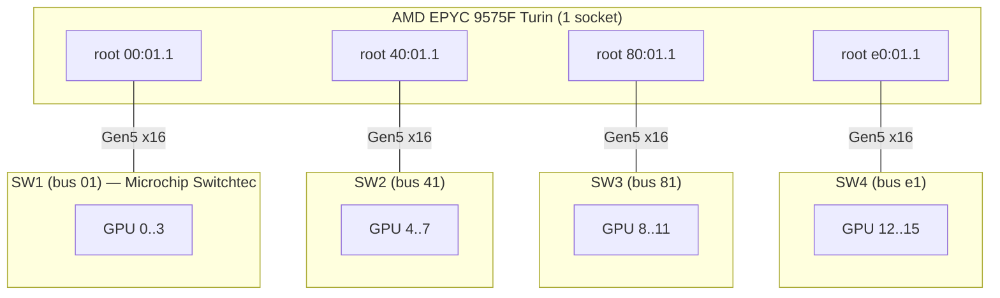

# ASRockRack GENOAD24QM32 + EPYC 9575F — 16 GPUs with 4× c-payne Switches

PCIe topology analysis and P2P benchmarks for a 16× RTX PRO 6000 Blackwell build on **ASRockRack GENOAD24QM32-2L2T/BCM** (single-socket SP5) with **AMD EPYC 9575F (Turin Zen 5)** and **4× c-payne Microchip Switchtec PM50100 Gen5 switches** (4 GPUs per switch). This is the same physical 16-GPU + 4× Microchip-switch arrangement as on the [WRX90 / Threadripper PRO 7955WX rig](wrx90-cpayne-16gpu-4switch.md), but on a completely different CPU + chipset platform.

The point of this page is to characterise:
1. Per-pair and aggregate P2P bandwidth on the new platform
2. Whether the catastrophic posted-write collapse (~11 GB/s WRITE) historically observed on this same 4-switch shape is reproducible on Turin EPYC.

Related pages:
- [`asus-esc8000a-e13p-broadcom-switches.md`](asus-esc8000a-e13p-broadcom-switches.md) — same EPYC family (dual-socket Turin) with **Broadcom PEX890xx** switches (collapses catastrophically).
- [`wrx90-cpayne-16gpu-4switch.md`](wrx90-cpayne-16gpu-4switch.md) — same 16-GPU + 4× Microchip layout on TR Pro 7955WX.

## Table of Contents

- [System Overview](#system-overview)
- [Physical PCIe Topology](#physical-pcie-topology)
- [Single-Pair P2P Bandwidth](#single-pair-p2p-bandwidth)
- [Multi-Pair Concurrency (Collapse Trigger Sweep)](#multi-pair-concurrency-collapse-trigger-sweep)
- [8-GPU Subset Benchmarks](#8-gpu-subset-benchmarks)
- [16-GPU All-to-All](#16-gpu-all-to-all)
- [Sustained Behaviour](#sustained-behaviour)
- [Comparison Against TR Pro 7955WX](#comparison-against-tr-pro-7955wx)
- [Posted-Write Collapse Status](#posted-write-collapse-status)
- [Hardware Notes](#hardware-notes)

---

## System Overview

| Component | Detail |
|---|---|
| Motherboard | ASRockRack GENOAD24QM32-2L2T/BCM (single-socket SP5) |
| BIOS | 10.08 (release 2026-01-07) |
| CPU | AMD EPYC 9575F (Turin Zen 5, 64-core, 1 socket) |
| RAM | DDR5 (single NUMA node) |
| GPUs | 16× NVIDIA RTX PRO 6000 Blackwell |
| PCIe Switches | 4× c-payne Microchip Switchtec PM50100 Gen5 (`1f18:0101`) |
| Kernel | 6.18.24-061824-generic |
| NVIDIA driver | 595.58.03 (open) |
| IOMMU | `amd_iommu=off iommu=off` |
| ACS Request-Redirect | cleared on every PCIe bridge with ACS capability (verified) |

The EPYC 9575F exposes 8 visible CPU root complexes on this board (PCI domain bus IDs `00`, `20`, `40`, `60`, `80`, `a0`, `c0`, `e0`). The 4 c-payne switches each land on one of those root complexes — see topology below.

---

## Physical PCIe Topology

```
SW1 (01:00.0)  →  root 00:01.1   (PCI domain 00)   GPU 0..3   (bus 03..06)
SW2 (41:00.0)  →  root 40:01.1   (PCI domain 40)   GPU 4..7   (bus 43..46)
SW3 (81:00.0)  →  root 80:01.1   (PCI domain 80)   GPU 8..11  (bus 83..86)
SW4 (e1:00.0)  →  root e0:01.1   (PCI domain e0)   GPU 12..15 (bus e3..e6)
```

All four switches are on **distinct root complexes**. No two switches share a root port. This is the "4-root variant" shape — different from the original WRX90 collapse layout where SW3+SW4 shared root `e0`.



All 4 switch upstream links train at PCIe **Gen5 x16** (32 GT/s). All GPU-side downstream ports also at Gen5 x16.

### Detection commands

```bash
# Switches
lspci -nn | grep "1f18:0101"

# GPU → switch → root complex mapping
for i in $(seq 0 15); do
  bus=$(nvidia-smi -i $i --query-gpu=gpu_bus_id --format=csv,noheader | sed 's/00000000://')
  root=$(readlink -f /sys/bus/pci/devices/0000:${bus,,}/../../.. \
         | grep -oE 'pci0000:[0-9a-f]+' | head -1)
  echo "GPU $i  bus $bus  -> $root"
done

# ACS state on switch downstream + root ports
for dev in 00:01.1 40:01.1 80:01.1 e0:01.1 \
           01:00.0 41:00.0 81:00.0 e1:00.0; do
  sudo lspci -s $dev -vvv | grep -A0 "ACSCtl:"
done
```

---

## Single-Pair P2P Bandwidth

CUDA `dst.copy_(src)` on src-owned stream, 256 MB buffer, 50 iterations.

| Pattern | Bandwidth |
|---|---|
| 1 pair, intra-switch (PIX) | **56.3 GB/s** |
| 1 pair, intra-quadrant (would-be PHB — N/A here, no two switches share a root) | — |
| 1 pair, cross-switch (NODE) | **56.3 GB/s** |
| 2 pairs, src→same dst switch (uplink saturation) | **56.4 GB/s** aggregate (one Gen5 x16 uplink saturated) |
| 2 pairs, intra-chip (e.g. (0,2)+(1,3) within one switch) | **(below)** |

The 56.4 GB/s 2-pair-saturation result confirms each c-payne is a separate physical switch chip with its own Gen5 x16 uplink — no Virtual-Switch chip-pairing on this layout.

### 4-pair within ONE switch (PIX, intra-chip all-to-all of 4 GPUs = 12 directional pairs)

| Switch | WRITE | READ | W/R |
|---|---|---|---|
| SW1 (intra) | **163.6 GB/s** | 67.4 | 2.43× |
| SW2 (intra) | 163.6 | 67.4 | 2.43× |
| SW3 (intra) | 163.6 | 67.4 | 2.43× |
| SW4 (intra) | 163.5 | 67.4 | 2.43× |

This 4-GPU-within-one-switch number is purely **switch-fabric routed** — it never touches the CPU root complex. The W/R asymmetry of 2.43× is therefore a **Microchip Switchtec characteristic** under intra-switch all-to-all contention, not a CPU IOD effect.

---

## Multi-Pair Concurrency (Collapse Trigger Sweep)

The historically catastrophic patterns from `wrx90-cpayne-16gpu-4switch.md` were re-run on this rig: 1 source switch dispatching concurrent posted writes to multiple destination switches.

### 12 patterns: 1 src switch → 2 dst switches

All numbers are aggregate WRITE / READ in GB/s, 50 iter, 256 MB buffers.

| Pattern | WRITE | READ | W/R |
|---|---|---|---|
| SW1 → SW2 + SW3 | 55.2 | 56.5 | 0.98× |
| SW1 → SW2 + SW4 | 55.1 | 57.0 | 0.97× |
| SW1 → SW3 + SW4 | 55.1 | 56.9 | 0.97× |
| SW2 → SW1 + SW3 | 55.3 | 57.0 | 0.97× |
| SW2 → SW1 + SW4 | 55.3 | 56.5 | 0.98× |
| SW2 → SW3 + SW4 | 55.3 | 56.5 | 0.98× |
| SW3 → SW1 + SW2 | 55.2 | 56.9 | 0.97× |
| SW3 → SW1 + SW4 | 55.3 | 56.5 | 0.98× |
| SW3 → SW2 + SW4 | 55.2 | 56.5 | 0.98× |
| SW4 → SW1 + SW2 | 53.5 | 56.5 | 0.95× |
| SW4 → SW1 + SW3 | 55.2 | 56.5 | 0.98× |
| SW4 → SW2 + SW3 | 55.3 | 56.5 | 0.98× |

All 12 patterns saturate the source uplink at ~55 GB/s WRITE. **No catastrophic collapse.** Worst W/R asymmetry across all 12 is 0.95× (`SW4→SW1+SW2`) — a 5 % dip, not a multi-fold cliff.

### 1 src → 3 dst switches (full fan-out)

| Pattern | WRITE | READ | W/R |
|---|---|---|---|
| SW1 → SW2+SW3+SW4 | 55.3 | 80.7 | **0.68×** |
| SW2 → SW1+SW3+SW4 | 57.5 | 79.1 | **0.73×** |
| SW3 → SW1+SW2+SW4 | **72.2** | **167.6** | **0.43×** |
| SW4 → SW1+SW2+SW3 | 55.3 | 56.7 | 0.97× |

Notable: **READ scales spectacularly above the source uplink.** Best case is `SW3→SW1+SW2+SW4` at **167.6 GB/s aggregate READ** — that's 3× a single Gen5 x16 uplink line rate. The Turin IO Die's read return path can pull from three different remote root complexes in parallel without saturating any single path.

WRITE on the same fan-outs caps near the source uplink (55–72 GB/s).

### 4-pair fan-out: 4 source GPUs from one switch

| Pattern | WRITE | READ | W/R |
|---|---|---|---|
| SW1 → 4×SW2 (1 dst, control) | 63.9 | 58.5 | 1.09× |
| SW1 → 2×SW2 + SW3 + SW4 | 55.3 | **107.5** | **0.51×** |
| SW1 → SW2 + 2×SW3 + SW4 | 72.0 | 110.7 | 0.65× |
| SW1 → SW2 + SW3 + 2×SW4 | 92.9 | 99.2 | 0.94× |
| 4-pair SW1→SW3 + 4-pair SW2→SW4 (2 src sw) | **112.8** | **112.8** | 1.00× |

The strongest WRITE/READ asymmetry under any pattern is **`(0,4)+(1,5)+(2,8)+(3,12)`: 55.3 W vs 107.5 R = 0.51×**. WRITE is still saturating the source uplink — it does not collapse.

The dual-source `4-pair SW1→SW3 + 4-pair SW2→SW4` test shows perfect scaling at 112.8 GB/s aggregate (2× single-switch uplink), confirming that two source switches operate independently when their destinations don't overlap.

---

## 8-GPU Subset Benchmarks

8-GPU all-to-all (56 directional pairs) for every pair of switches:

| Subset | Aggregate WRITE | Aggregate READ | W/R |
|---|---|---|---|
| SW1 + SW2 (Q0+Q1) | **190.0 GB/s** | 74.3 | 2.56× |
| SW3 + SW4 (Q2+Q3) | 187.9 | 74.3 | 2.53× |
| SW1 + SW3 (opposite corners) | 190.0 | 74.3 | 2.56× |
| SW1 + SW4 | 188.5 | 74.3 | 2.54× |
| SW2 + SW3 | 187.6 | 74.3 | 2.52× |
| SW2 + SW4 | 190.4 | 74.3 | 2.56× |

8-GPU aggregate WRITE is **uniform at 187–190 GB/s regardless of which two switches are paired**. Both source uplinks (each Gen5 x16 = 56 GB/s) plus their intra-switch traffic produce ~190 GB/s aggregate.

8-GPU aggregate READ is uniform at ~74 GB/s. The W/R asymmetry of 2.5× is a switch-fabric property (see intra-switch numbers above), not a topology shape effect.

---

## 16-GPU All-to-All

Full 16 × 16 P2P all-to-all (240 directional pairs):

| Metric | Value |
|---|---|
| Aggregate WRITE | **204.4 GB/s** |
| Aggregate READ | 64.5 GB/s |
| W/R | 3.17× |
| Per-pair WRITE | 0.85 GB/s |
| Per-pair READ | 0.27 GB/s |

The WRITE figure of **204 GB/s** is **~91 % of the theoretical 4 × 56 = 224 GB/s** ceiling set by four independent Gen5 x16 source uplinks running fully saturated in parallel. The Turin IO Die distributes these 4 concurrent posted-write streams across its inter-quadrant fabric without any of them collapsing.

---

## Sustained Behaviour

Long iter-count check on the trigger-shape patterns — does the W/R asymmetry deepen with sustained load?

| Pattern | iter 50 W/R | iter 200 W/R |
|---|---|---|
| 3-pair `SW1 → SW2+SW3+SW4` | 55.3 W / 80.7 R = 0.68× | 55.5 W / 80.7 R = 0.69× |
| 4-pair `SW1 → 2×SW2+SW3+SW4` | 55.3 W / 107.5 R = 0.51× | 67.0 W / 110.0 R = 0.61× |

No drift to deeper collapse — the asymmetry is steady-state.

---

## Comparison Against TR Pro 7955WX

Same 16 GPU + 4× Microchip layout, same per-switch GPU population, same software stack class. Only the host platform differs.

| Metric | EPYC 9575F (Turin) — this page | TR Pro 7955WX (3-root variant on current stack) |
|---|---|---|
| Single-pair BW | 56.3 GB/s | ~53 GB/s |
| 2-pair uplink saturation | 56.4 GB/s | 56.4 GB/s |
| 8-GPU all-to-all (any 2 SW) | **187–190 GB/s** | ~163 GB/s |
| 16-GPU all-to-all WRITE | **204 GB/s** | not reported |
| 1-src → 3-dst WRITE worst | 55 GB/s | 56 GB/s (similar) |
| 1-src → 3-dst READ best | **167 GB/s** | 84 GB/s |
| 4-pair fan-out worst W/R | 0.43× | 0.52× |
| Catastrophic write collapse | **none** | none on current stack |
| Intra-switch 4-pair (12 pair all-to-all) | 163 W / 67 R | not separately reported |

Turin pushes substantially more aggregate cross-switch bandwidth than TR Pro on the same Microchip switches:
- 8-GPU all-to-all WRITE is **+17 %** (190 vs 163 GB/s)
- 1-src → 3-dst READ peak is **+99 %** (167 vs 84 GB/s)

The Turin IO Die appears to have a more capable inter-quadrant return path for read traffic, which translates directly into the dramatically higher aggregate READ under fan-out.

---

## Posted-Write Collapse Status

**No catastrophic posted-write collapse was observed on this platform** in any of the patterns tested:
- 12 patterns of 1-src → 2-dst — all uplink-saturated WRITE (53–55 GB/s), no W/R cliff.
- 4 patterns of 1-src → 3-dst — WRITE always ≥ 55 GB/s, W/R worst 0.43× because READ scales to 167 GB/s, not because WRITE collapses.
- 4-pair fan-out — same shape: WRITE saturated, READ scales.
- Sustained 200-iter — no drift.

This matches the behaviour seen on the WRX90 + 4× Microchip rig on its current platform stack (kernel 6.18 / driver 595.58.03 / BIOS 12.09). The historical 11 GB/s catastrophic WRITE drop documented for the original 16-GPU collapse measurement does not reproduce on EPYC Turin either.

The mild W/R asymmetries (0.43–0.97×) seen here are the residual signature of inter-quadrant arbitration — present, but driven by the *return* path scaling READ faster than the source uplink can WRITE. WRITE itself never falls below source uplink line rate.

---

## Hardware Notes

### ACS

All 8 ACS-capable bridges checked (4 root ports + 4 switch upstream ports) report `ReqRedir- CmpltRedir-` cleared. P2P is fabric-routed within a switch and uses CPU root ports for cross-switch as expected.

### PCIe links

All GPUs and all switch upstream/downstream ports trained at **Gen5 x16** (32 GT/s) under load. No degraded links.

### IOMMU

`amd_iommu=off iommu=off` set in kernel cmdline. (On EPYC the default is sometimes `iommu=pt`, which has historically interacted with the posted-write arbitration in unhelpful ways — verify your boot options match before trusting these numbers.)

### MaxReadReq

Microchip Switchtec downstream ports hardcoded at 128 B (read-only). Root ports and GPUs at 512 B. Not topology-specific.

### Peer mapping limit

CUDA `cudaDeviceEnablePeerAccess` is capped at 8 peers per GPU per process — full 16×16 mesh in one process not possible. Pair-by-pair P2P or NCCL/IPC handles required for 9+ GPU code.
