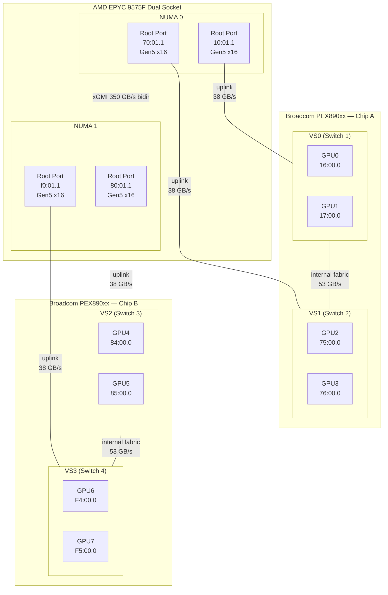
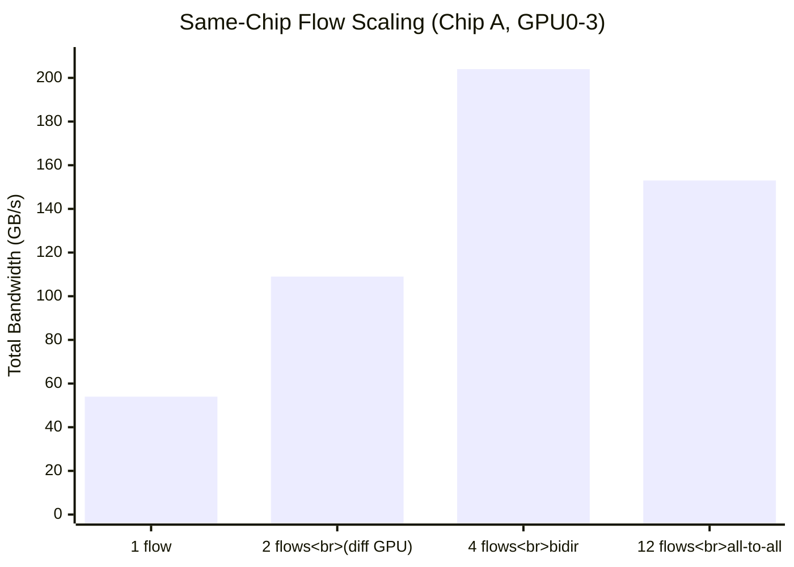
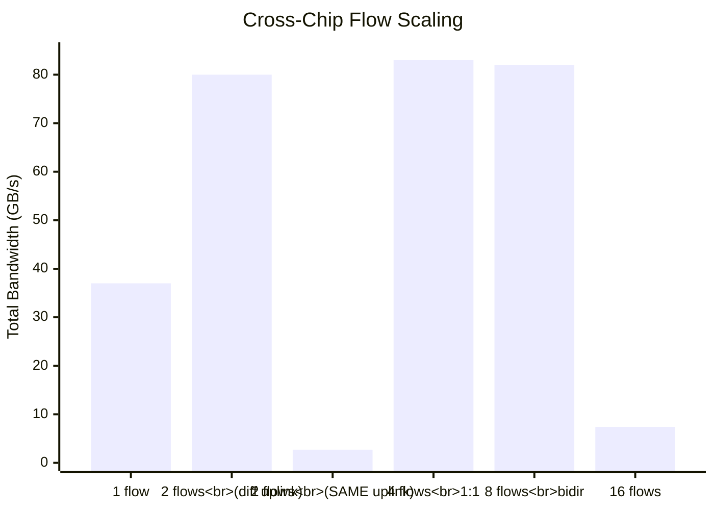

# ASUS ESC8000A-E13P with Broadcom PEX890xx Switches

Detailed PCIe topology analysis, ACS configuration, performance measurements, and a critical posted-write arbitration bug discovered on the Broadcom PEX890xx Gen5 PCIe switches in the ASUS ESC8000A-E13P server.

## Table of Contents

- [System Overview](#system-overview)
- [Physical PCIe Topology](#physical-pcie-topology)
- [ACS (Access Control Services) — Critical for P2P](#acs-access-control-services--critical-for-p2p)
- [PEX890xx Posted-Write Arbitration Bug](#pex890xx-posted-write-arbitration-bug)
- [Complete Link Map](#complete-link-map)
- [Multi-Flow Contention Analysis](#multi-flow-contention-analysis)
- [P2P Bandwidth Results](#p2p-bandwidth-results)
- [p2pmark Benchmark Results](#p2pmark-benchmark-results)
- [NCCL Configuration](#nccl-configuration)
- [Hardware Configuration Issues](#hardware-configuration-issues)
- [Proving P2P Goes Through Switch Fabric](#proving-p2p-goes-through-switch-fabric)
- [Reproduction Steps](#reproduction-steps)
- [Quick Reference: ACS Disable Script](#quick-reference-acs-disable-script)

---

## System Overview

| Component | Detail |
|-----------|--------|
| **Motherboard** | ASUS ESC8000A-E13P (K15PG-D24 Series) |
| **CPUs** | 2x AMD EPYC 9575F 64-Core (Turin) |
| **NUMA Nodes** | 2 (GPU0-3 on NUMA 0, GPU4-7 on NUMA 1) |
| **GPUs** | 8x NVIDIA RTX PRO 6000 Blackwell Server Edition (96 GB GDDR7 each) |
| **PCIe Switches** | 2x Broadcom PEX890xx Gen 5 (each partitioned into 2 Virtual Switches) |
| **PCIe Link** | Gen5 x16 per GPU (32 GT/s, ~63 GB/s theoretical per direction) |

---

## Physical PCIe Topology

The system uses **two physical Broadcom PEX890xx switch chips**, each partitioned into **two Virtual Switches (VS)**. Each VS has its own dedicated upstream port — uplinks cannot be aggregated.



### Key Architecture Points

- Each physical chip has **2 upstream ports** (one per VS) and **4 downstream ports** (for GPUs)
- **Uplinks are NOT aggregatable** — each VS has exactly one dedicated upstream port
- **Internal fabric** connects both VS partitions within one chip at full speed (~53 GB/s unidirectional)
- **Cross-chip traffic** must traverse: GPU → switch → uplink → CPU root port → (xGMI if cross-NUMA) → CPU root port → uplink → switch → GPU
- There is **no root switch** connecting the two chips directly (unlike PM50100-based topologies)

### nvidia-smi Topology

```
$ nvidia-smi topo -m
        GPU0  GPU1  GPU2  GPU3  GPU4  GPU5  GPU6  GPU7
GPU0     X    PIX   NODE  NODE  SYS   SYS   SYS   SYS     NUMA 0
GPU1    PIX    X    NODE  NODE  SYS   SYS   SYS   SYS     NUMA 0
GPU2    NODE  NODE   X    PIX   SYS   SYS   SYS   SYS     NUMA 0
GPU3    NODE  NODE  PIX    X    SYS   SYS   SYS   SYS     NUMA 0
GPU4    SYS   SYS   SYS   SYS   X    PIX   NODE  NODE    NUMA 1
GPU5    SYS   SYS   SYS   SYS  PIX    X    NODE  NODE    NUMA 1
GPU6    SYS   SYS   SYS   SYS  NODE  NODE   X    PIX     NUMA 1
GPU7    SYS   SYS   SYS   SYS  NODE  NODE  PIX    X      NUMA 1
```

> **Important:** `nvidia-smi topo` does NOT show physical chip grouping. GPU0 and GPU2 appear as `NODE` but are on the **same physical chip** with internal fabric. This was discovered through bandwidth measurements and uplink degradation tests.

---

## ACS (Access Control Services) — Critical for P2P

By default, ACS is enabled on both **AMD root ports** and **Broadcom switch downstream ports**. When ACS `ReqRedir` and `CmpltRedir` are set, all P2P traffic is forced through the upstream root port instead of routing through the switch fabric.

### Impact: Before vs After ACS Disable

| GPU Pair | Relationship | ACS ON (default) | ACS OFF |
|---|---|---|---|
| GPU0↔GPU1 | PIX (same VS) | ~50 GB/s | **~103 GB/s** |
| GPU0↔GPU2 | Same chip, cross-VS | ~103 GB/s | ~103 GB/s |
| GPU0↔GPU4 | Cross-chip | ~95 GB/s | ~95 GB/s |

ACS must be disabled on **two levels**:

1. **AMD Root Ports** — ACS capability at offset `0x2a0`, control register at `0x2a6`
2. **Broadcom Switch Downstream Ports** — ACS capability at offset `0x170`, control register at `0x176`

Disabling only the root ports is **NOT sufficient**. See [Quick Reference: ACS Disable Script](#quick-reference-acs-disable-script) for the full procedure.

---

## PEX890xx Posted-Write Arbitration Bug

### Summary

We discovered a critical performance bug in the Broadcom PEX890xx switch: when two or more different GPUs on the same switch partition simultaneously send **posted write** TLPs through one shared uplink to destinations behind **two or more different CPU root ports**, bandwidth collapses from ~37 GB/s to **2.7 GB/s** (93% loss).

**This affects only posted writes. Non-posted reads (with completions) do not collapse.**

### Exact Trigger Condition

All of the following must be true **simultaneously**:

1. Two or more **different GPUs** on the **same Virtual Switch** (sharing one uplink)
2. Sending **posted write** TLPs concurrently
3. Through **one shared upstream port**
4. To destinations behind **two or more different CPU root ports**

### Measured Results

```mermaid
xychart-beta
    title "Posted Writes vs Non-Posted Reads — Collapse Test"
    x-axis ["1 flow", "2 flows OK", "2 flows COLLAPSE", "16 cross", "56 all-to-all"]
    y-axis "Bandwidth (GB/s)" 0 --> 80
    bar "Posted Write" [36.8, 76.4, 2.7, 7.7, 36.5]
    bar "Non-Posted Read" [40.1, 44.8, 51.1, 9.0, 53.9]
```



| Test | Posted Write (GB/s) | Non-Posted Read (GB/s) |
|---|---|---|
| 1 flow: GPU0→GPU4 | 36.8 | 40.1 |
| 2 flows OK: GPU0→GPU4 + GPU2→GPU6 (diff VS) | 76.4 | 44.8 |
| **2 flows COLLAPSE: GPU0→GPU4 + GPU1→GPU6 (same VS)** | **2.7** | **51.1** |
| 4 flows collapse: GPU0,1→GPU4,5,6,7 | 2.7 | 51.3 |
| 16 flows cross-chip | 7.7 | 9.0 |
| 56 flows all-to-all | 36.5 | 53.9 |

### What Does NOT Trigger Collapse

| Scenario | Write BW | Why it works |
|---|---|---|
| Same GPU → multiple root ports (GPU0→GPU4 + GPU0→GPU6) | 36.6 GB/s | Single DMA engine, serialized at DS port |
| Different VS → different root ports (GPU0→GPU4 + GPU2→GPU6) | 76.4 GB/s | Different uplinks, no contention |
| Same VS → same root port (GPU0→GPU4 + GPU1→GPU5) | 40.3 GB/s | Same target root port, normal sharing |
| Reverse direction (GPU4→GPU0 + GPU6→GPU1) | 51.2 GB/s | Different source chip, no shared uplink |
| Non-posted reads (any pattern) | 40-51 GB/s | Completion-based flow control |
| P2P disabled (SHM through host memory) | 2.7 GB/s | **Same collapse!** Same uplink path |

### Root Cause Analysis

Posted writes in PCIe do not require completions — the switch must buffer and route them internally. When multiple requesters on the same VS send posted writes through one uplink to different destination root ports, the switch's internal posted-write arbitration/credit mechanism enters a pathological state (likely livelock or credit exhaustion).

Non-posted reads work because each read request generates a completion from the target, providing natural flow control that prevents the arbitration pathology.

This behavior is:
- **Independent of transfer size** (tested 4MB to 1024MB — same collapse)
- **Independent of MaxReadReq** (tested 128B, 512B, 4096B — same collapse)
- **Independent of P2P vs SHM** (same uplink path in both cases)
- **Direction-dependent** (only source→remote collapses, not remote→source)

---

## Complete Link Map

### Measured Bandwidth Per Link

| Link | Type | Unidirectional | Bidirectional | Theory | Efficiency |
|---|---|---|---|---|---|
| GPU ↔ switch DS port | Gen5 x16 | 53.5 GB/s | 101 GB/s | 63 GB/s | 85% |
| Switch internal fabric (cross-VS) | chip-internal | 53.6 GB/s | 101 GB/s | — | = PIX |
| Cross-chip end-to-end | 2 uplinks + CPU | 38 GB/s | 70 GB/s | 63 GB/s | 60% |
| xGMI fabric (CPU memcpy) | CPU-to-CPU | 55 GB/s | 350 GB/s | — | — |

### Full 8×8 Unidirectional Bandwidth Matrix (GB/s)

```
 Dst→   GPU0   GPU1   GPU2   GPU3   GPU4   GPU5   GPU6   GPU7
GPU0:    —     53.9   53.8   53.4   35.9   36.7   36.6   37.0
GPU1:  53.8     —     53.4   53.7   36.0   36.4   36.6   36.9
GPU2:  53.9   53.7     —     53.6   39.1   39.3   38.9   39.2
GPU3:  53.5   53.6   53.3     —     39.1   39.4   39.0   38.9
GPU4:  39.7   39.7   36.1   36.9     —     53.1   53.7   53.3
GPU5:  39.5   39.7   36.2   36.9   53.4     —     53.4   53.8
GPU6:  38.9   39.0   40.0   39.7   53.8   53.4     —     53.1
GPU7:  39.8   39.0   40.2   40.0   53.5   53.9   53.2     —
```

---

## Multi-Flow Contention Analysis

### Same-Chip Scaling (No Uplink Used)



| Flows | Config | Total BW | Per-flow | Notes |
|---|---|---|---|---|
| 1 | GPU0→GPU1 | 54.1 GB/s | 54.1 | Baseline |
| 2 | GPU0→GPU1 + GPU2→GPU3 | 108.6 GB/s | 54.3 | Perfect scaling |
| 4 | Both pairs bidir | 203.9 GB/s | 51.0 | Near-perfect |
| 12 | 4-GPU all-to-all | 153 GB/s | 12.7 | DS port contention |

### Cross-Chip Scaling (Uplinks Used)



| Flows | Config | Total BW | Per-flow | Status |
|---|---|---|---|---|
| 1 | GPU0→GPU4 | 37.7 GB/s | 37.7 | OK |
| 2 | Different uplinks (GPU0→4 + GPU2→6) | 80.2 GB/s | 40.1 | Perfect scaling |
| **2** | **Same uplink, diff targets (GPU0→4 + GPU1→6)** | **2.7 GB/s** | **1.35** | **COLLAPSE** |
| 4 | 1:1 mapping all pairs | 83.2 GB/s | 20.8 | OK |
| 8 | All pairs bidir | 82.2 GB/s | 10.3 | Uplink saturated |
| 16 | All A→B | 7.4 GB/s | 0.5 | Collapse |

### GPU DS Port Is the Bandwidth Limit

Each GPU has one Gen5 x16 downstream port (~53 GB/s). All flows from one GPU share this port:

| Test | Total BW | Notes |
|---|---|---|
| 2 flows from SAME GPU (GPU0→GPU4 + GPU0→GPU2) | 42.8 GB/s | DS port shared |
| 2 flows from DIFFERENT GPU (GPU0→GPU4 + GPU1→GPU2) | 106.3 GB/s | No interference |
| 4 flows, all different GPU | 206.8 GB/s | Perfect scaling |
| 4 flows, all from GPU0 | 47.6 GB/s | DS port = ~53 GB/s max |

---

## P2P Bandwidth Results

### Bidirectional P2P=Enabled Bandwidth Matrix (ACS disabled, all links Gen5 x16)

```
   D\D     0      1      2      3      4      5      6      7
     0    —    102    103    103     94     95     94     94
     1   104    —     103    104     94     93     94     95
     2   103   103     —     103     95     96     95     96
     3   103   102    103     —      95     95     96     94
     4    95    95     95     93     —     103    104    103
     5    94    93     94     96    103     —     103    103
     6    94    95     96     95    103    103     —     103
     7    96    96     95     95    103    103    103     —
```

### P2P Latency (microseconds)

| Path | Latency |
|---|---|
| Same NUMA | 0.71–0.74 µs |
| Cross NUMA (Infinity Fabric) | 1.27–1.36 µs |

---

## p2pmark Benchmark Results

All results measured with [p2pmark](https://github.com/lukealonso/p2pmark) version `3c39f36` (same version used by luke, Festr, and Grimulkan for reference scores).

### Comparison with Reference Systems

| System | GPUs | PCIe Score | Interconnect Score | Eff. Latency |
|---|---|---|---|---|
| **This system (ACS off)** | 4 | **0.88** | **0.58** (128 / 221 GB/s) | 2.12 µs |
| luke (3× Microchip switches) | 4 | 0.86 | 0.64 (138 / 218 GB/s) | 4.10 µs |
| Festr (dual Turin, direct-attach) | 4 | 0.88 | 0.59 (130 / 221 GB/s) | 2.28 µs |
| **This system (ACS off)** | 8 | **0.85** | **0.12** (52 / 429 GB/s) | 7.39 µs |
| luke (3× Microchip switches) | 8 | 0.86 | 0.44 (192 / 435 GB/s) | 6.79 µs |
| Festr (dual Turin, direct-attach) | 8 | 0.84 | 0.41 (173 / 421 GB/s) | 6.03 µs |

The low 8-GPU interconnect score (0.12) is caused by the posted-write arbitration bug collapsing all-to-all bandwidth.

### AllReduce: Custom vs NCCL (4 GPU, fp16)

| Size | Custom (µs) | NCCL (µs) | Winner |
|---|---|---|---|
| 256 B | 6.2 | 14.1 | Custom 2.3× |
| 32 KB | 10.1 | 15.4 | Custom 1.5× |
| 512 KB | 51.3 | 72.0 | Custom 1.4× |
| 1 MB | 95.8 | 86.5 | NCCL 1.1× |
| 32 MB | 2884 | 1628 | NCCL 1.8× |

### AllReduce: Custom vs NCCL (8 GPU, fp16)

| Size | Custom (µs) | NCCL (µs) | Winner |
|---|---|---|---|
| 256 B | 8.3 | 27.1 | Custom 3.3× |
| 4 KB | 30.6 | 57.2 | Custom 1.9× |
| 8 KB | 64.3 | 57.6 | NCCL 1.1× |
| 64 KB | 503.9 | 67.8 | NCCL 7.4× |
| 32 MB | 333806 | 2715 | NCCL 122.9× |

---

## NCCL Configuration

By default, NCCL uses **SHM** for NODE pairs. Force P2P everywhere:

```bash
export NCCL_P2P_LEVEL=SYS
export NCCL_NET_GDR_LEVEL=SYS
export NCCL_MIN_NCHANNELS=8
```

AllReduce BusBw (32M, 4 GPU): default = 30.3 GB/s → **NCCL_P2P_LEVEL=SYS = 39.3 GB/s**.

---

## PCIe Oneshot AllReduce — Inference Benchmark

End-to-end inference benchmark using [luke's PCIe oneshot allreduce](https://github.com/lukealonso/sglang/commit/d39236aee635cca2725f94539358da0d1c85d8c2) on Qwen3.5-397B-A17B-NVFP4 with TP=4 and speculative decoding (MTP).

For patch application instructions, see [PCIe Oneshot AllReduce Guide](../optimization/pcie-oneshot-allreduce.md).

### Raw AllReduce Crossover (PCIe oneshot vs NCCL, 4 GPU, bf16)

```
  1KB:  custom    6.1 µs  vs  NCCL   13.5 µs  → custom 2.2×
  4KB:  custom    6.5 µs  vs  NCCL   13.2 µs  → custom 2.0×
 16KB:  custom    7.7 µs  vs  NCCL   14.7 µs  → custom 1.9×
 64KB:  custom   11.8 µs  vs  NCCL   71.2 µs  → custom 6.0×
256KB:  custom   28.7 µs  vs  NCCL   40.9 µs  → custom 1.4×
  1MB:  custom   95.6 µs  vs  NCCL   85.2 µs  → NCCL wins
```

Crossover at 512 KB. For messages up to 512 KB, PCIe oneshot is **1.4–6.0× faster**.

### End-to-End Decode Throughput (tok/s)

```mermaid
xychart-beta
    title "Aggregate Throughput: PCIe Oneshot vs NCCL"
    x-axis ["c=1", "c=2", "c=4", "c=8", "c=16", "c=32", "c=64"]
    y-axis "Tokens/sec" 0 --> 1400
    bar "PCIe oneshot" [74.9, 119.8, 217.5, 375.2, 608.1, 989.0, 1376.9]
    bar "NCCL only" [67.3, 110.8, 202.8, 356.1, 577.3, 940.2, 1283.1]
```



| Concurrency | PCIe oneshot | NCCL only | Improvement |
|---|---|---|---|
| 1 | 74.9 tok/s | 67.3 tok/s | **+11.3%** |
| 4 | 217.5 tok/s | 202.8 tok/s | +7.3% |
| 16 | 608.1 tok/s | 577.3 tok/s | +5.3% |
| 32 | 989.0 tok/s | 940.2 tok/s | +5.2% |
| 64 | 1376.9 tok/s | 1283.1 tok/s | +7.3% |

PCIe oneshot allreduce is consistently **5–11% faster** than NCCL across all concurrency levels. Largest improvement at single-request latency (+11.3%).

### Effect of NCCL_P2P_LEVEL=SYS

| Config | c=1 | c=64 | Notes |
|---|---|---|---|
| PCIe oneshot | 74.9 | 1376.9 | SYS has no effect (~0%) |
| PCIe oneshot + SYS | 74.6 | 1390.5 | Negligible difference |
| NCCL only | 67.3 | 1283.1 | — |
| NCCL + SYS | 69.7 | 1381.1 | **+3.6%** at c=1, closes gap at c=64 |

`NCCL_P2P_LEVEL=SYS` only matters for NCCL (small improvement). PCIe oneshot bypasses NCCL for small messages, so SYS has no effect.

---

## Hardware Configuration Issues

### MaxReadReq Locked at 128 Bytes on Switch Ports

| Device | MaxReadReq | Writable? |
|---|---|---|
| Switch upstream/downstream ports | 128 bytes | **NO** (read-only) |
| GPU endpoints | 512 bytes | Yes |
| CPU root ports | 512 bytes | Yes |

Changing GPU/RP MaxReadReq does **not** help — tested 128, 512, 4096. Default 512 is optimal.

### 10-Bit Tag Disabled on Switch Ports

Switch ports: `10BitTagComp+` (capable) but `10BitTagReq-` (disabled). Register is read-only.

### Switch Registers Are Read-Only

All PCIe DevCtl/DevCtl2 registers on Broadcom switch ports are firmware-locked. Verified through:
- `setpci` writes (silently ignored)
- PlxCm `pcr` writes (accepted but not applied)
- PlxSvc driver `reg` commands (error 524 — PEX89000 uses different internal register layout than PLX 8000)
- Broadcom SDK v9.81 compiled and loaded, but PEX89000 MRPC interface requires vendor-proprietary tooling

---

## Proving P2P Goes Through Switch Fabric

By deliberately degrading upstream link speed to Gen2, we proved that same-chip P2P never uses the uplink:

| Path | Gen5 (normal) | Gen2 (degraded uplink) | Uses Uplink? |
|---|---|---|---|
| Same-switch (PIX) | 103 GB/s | **103 GB/s** (unchanged) | **NO** |
| Same-chip cross-VS | 103 GB/s | **103 GB/s** (unchanged) | **NO** |
| Cross-chip | 95 GB/s | **14 GB/s** (degraded) | **YES** |

---

## Reproduction Steps

### Prerequisites

```bash
# Install tools
apt-get install -y pciutils python3 python3-pip
pip install --break-system-packages torch

# Disable ACS (required for P2P through switch fabric)
/usr/local/bin/disable-acs.sh

# Verify ACS is off
lspci -vv 2>/dev/null | grep "ACSCtl:" | grep -c "ReqRedir+"
# Should output: 0
```

### Test 1: Verify Posted-Write Collapse

```python
import torch, time

# Enable P2P
for i in range(8):
    torch.cuda.set_device(i)
    for j in range(8):
        if i != j:
            try: torch.cuda.enable_peer_access(j)
            except: pass

SIZE = 256 * 1024 * 1024
ITERS = 20

def concurrent_write(pairs):
    """Posted write: GPU pushes data to remote"""
    bufs = {}; streams = {}
    for s, d in pairs:
        bufs[(s,d)] = (torch.randn(SIZE//4, device=f'cuda:{s}'),
                       torch.empty(SIZE//4, device=f'cuda:{d}'))
        torch.cuda.set_device(s)
        streams[(s,d)] = torch.cuda.Stream(torch.device(f'cuda:{s}'))
    for s, d in pairs:
        with torch.cuda.stream(streams[(s,d)]): bufs[(s,d)][1].copy_(bufs[(s,d)][0])
    torch.cuda.synchronize()
    t0 = time.perf_counter()
    for _ in range(ITERS):
        for s, d in pairs:
            with torch.cuda.stream(streams[(s,d)]): bufs[(s,d)][1].copy_(bufs[(s,d)][0])
    torch.cuda.synchronize()
    return SIZE * ITERS * len(pairs) / (time.perf_counter() - t0) / 1e9

def concurrent_read(pairs):
    """Non-posted read: GPU pulls data from remote"""
    bufs = {}; streams = {}
    for s, d in pairs:
        bufs[(s,d)] = (torch.randn(SIZE//4, device=f'cuda:{d}'),
                       torch.empty(SIZE//4, device=f'cuda:{s}'))
        torch.cuda.set_device(s)
        streams[(s,d)] = torch.cuda.Stream(torch.device(f'cuda:{s}'))
    for s, d in pairs:
        with torch.cuda.stream(streams[(s,d)]): bufs[(s,d)][1].copy_(bufs[(s,d)][0])
    torch.cuda.synchronize()
    t0 = time.perf_counter()
    for _ in range(ITERS):
        for s, d in pairs:
            with torch.cuda.stream(streams[(s,d)]): bufs[(s,d)][1].copy_(bufs[(s,d)][0])
    torch.cuda.synchronize()
    return SIZE * ITERS * len(pairs) / (time.perf_counter() - t0) / 1e9

# COLLAPSE trigger: 2 GPUs from same VS → 2 different target root ports
collapse_pairs = [(0,4),(1,6)]  # GPU0(VS0)→GPU4(VS2) + GPU1(VS0)→GPU6(VS3)
ok_pairs = [(0,4),(2,6)]        # GPU0(VS0)→GPU4(VS2) + GPU2(VS1)→GPU6(VS3) — diff VS

print("COLLAPSE test (same VS, diff target root ports):")
print(f"  Write: {concurrent_write(collapse_pairs):.1f} GB/s  ← should be ~2.7 (COLLAPSE)")
print(f"  Read:  {concurrent_read(collapse_pairs):.1f} GB/s  ← should be ~51 (NO collapse)")

print("\nOK test (different VS):")
print(f"  Write: {concurrent_write(ok_pairs):.1f} GB/s  ← should be ~75")
print(f"  Read:  {concurrent_read(ok_pairs):.1f} GB/s  ← should be ~45")
```

### Test 2: Uplink Degradation (Prove P2P Uses Switch Fabric)

```bash
# Degrade uplink 10:01.1 to Gen2, measure GPU0→GPU1 (same chip, should be unaffected)
cur=$(setpci -s 10:01.1 88.w)
new=$(printf "%04x" $(( (16#$cur & 0xFFF0) | 0x0002 )))
setpci -s 10:01.1 88.w=0x$new
cur_ctl=$(setpci -s 10:01.1 68.w)
retrain=$(printf "%04x" $(( 16#$cur_ctl | 0x0020 )))
setpci -s 10:01.1 68.w=0x$retrain
sleep 2
lspci -vvs 10:01.1 | grep LnkSta  # Should show Gen2

# Run p2pBandwidthLatencyTest — same-chip pairs should still show ~103 GB/s bidir
# Cross-chip pairs should show ~14 GB/s

# Restore Gen5
cur=$(setpci -s 10:01.1 88.w)
new=$(printf "%04x" $(( (16#$cur & 0xFFF0) | 0x0005 )))
setpci -s 10:01.1 88.w=0x$new
cur_ctl=$(setpci -s 10:01.1 68.w)
retrain=$(printf "%04x" $(( 16#$cur_ctl | 0x0020 )))
setpci -s 10:01.1 68.w=0x$retrain
```

### Test 3: p2pmark Benchmarks

```bash
# Install p2pmark (use old version 3c39f36 for comparable scores)
git clone https://github.com/lukealonso/p2pmark.git
cd p2pmark && git checkout 3c39f36
make NVCC=/usr/local/cuda/bin/nvcc
cp p2pmark p2pmark_old

# 4 GPU (same NUMA)
CUDA_VISIBLE_DEVICES=0,1,2,3 ./p2pmark_old

# 8 GPU
./p2pmark_old

# Latency
./p2pmark_old --latency

# AllReduce
./p2pmark_old --allreduce
```

---

## Quick Reference: ACS Disable Script

```bash
#!/bin/bash
# /usr/local/bin/disable-acs.sh
# Disable ACS P2P redirect on all PCIe bridges. Run after every boot.

python3 -c "
import subprocess, re
out = subprocess.check_output(['lspci', '-vv'], text=True, timeout=30)
devices = out.split('\n\n')
count = 0
for dev in devices:
    lines = dev.strip().split('\n')
    if not lines or not lines[0]: continue
    bdf = lines[0].split()[0]
    acs_offset = None
    for line in lines:
        if 'Access Control Services' in line:
            m = re.search(r'\[([0-9a-fA-F]+)\s', line)
            if m: acs_offset = m.group(1)
        if 'ACSCtl:' in line and 'ReqRedir+' in line and acs_offset:
            ctrl_offset = int(acs_offset, 16) + 6
            subprocess.run(['setpci', '-s', bdf, f'{ctrl_offset:x}.w=0x0011'], check=True)
            count += 1
            print(f'  Disabled ACS on {bdf} (ctrl@0x{ctrl_offset:x})')
            break
print(f'Done. Disabled ACS on {count} devices.')
"
remaining=$(lspci -vv 2>/dev/null | grep "ACSCtl:" | grep -c "ReqRedir+")
echo "Devices with ReqRedir+ remaining: $remaining"
```

Systemd service for automatic startup:

```bash
chmod +x /usr/local/bin/disable-acs.sh

cat > /etc/systemd/system/disable-acs.service << 'EOF'
[Unit]
Description=Disable PCIe ACS for GPU P2P
After=nvidia-persistenced.service

[Service]
Type=oneshot
ExecStart=/usr/local/bin/disable-acs.sh
RemainAfterExit=yes

[Install]
WantedBy=multi-user.target
EOF

systemctl enable disable-acs.service
```
