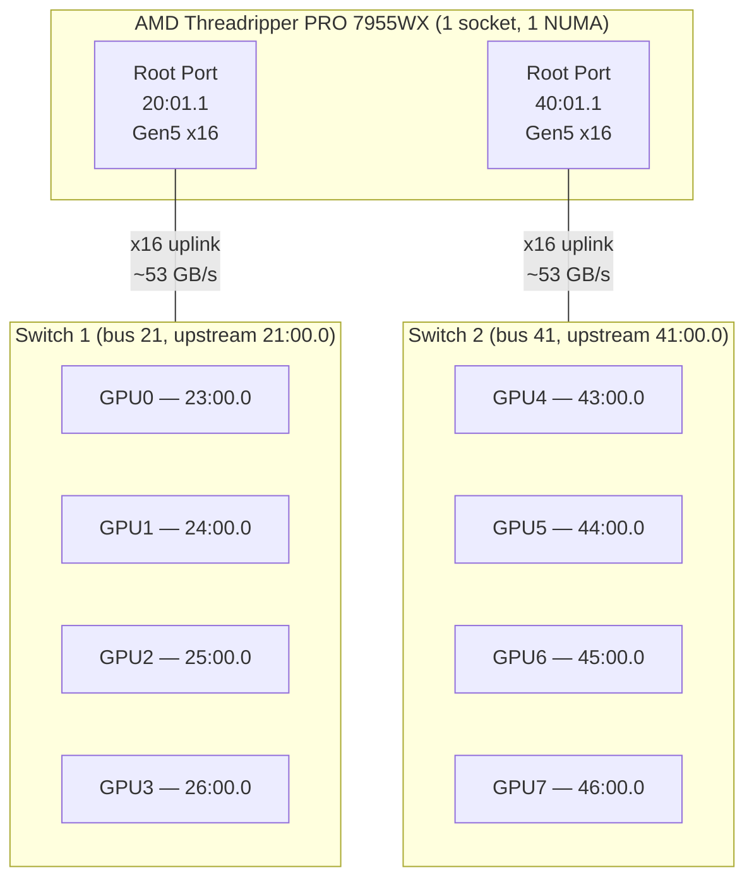
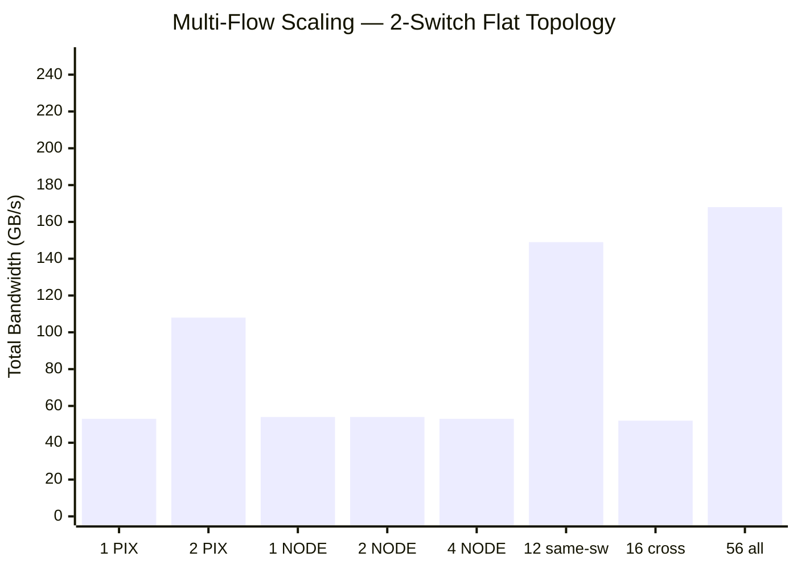
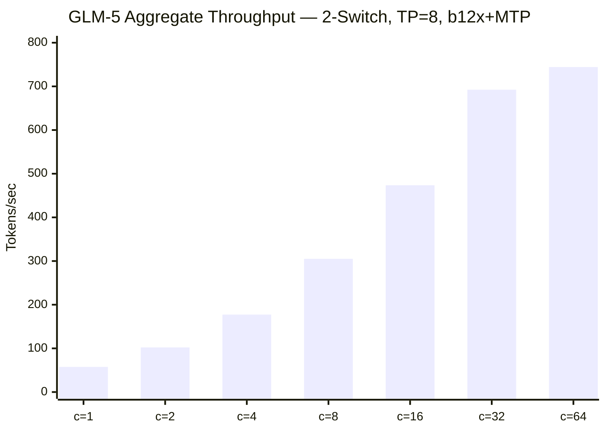

# ASRock WRX90 WS EVO — 2× c-payne Switches (Flat Topology)

PCIe topology analysis and P2P benchmarks for the same ASRock WRX90 WS EVO system reconfigured with **2 switches** instead of 3, using a flat (non-hierarchical) layout. Each switch connects 4 GPUs directly to one CPU root port — no root switch.

For comparison with the 3-switch hierarchical topology on the same hardware, see [WRX90 + 3× c-payne Switches](wrx90-cpayne-microchip-switches.md).

## Table of Contents

- [System Overview](#system-overview)
- [Physical PCIe Topology](#physical-pcie-topology)
- [P2P Bandwidth Results](#p2p-bandwidth-results)
- [P2P Latency Results](#p2p-latency-results)
- [p2pmark Benchmark Results](#p2pmark-benchmark-results)
- [PCIe Oneshot AllReduce Crossover](#pcie-oneshot-allreduce-crossover)
- [Multi-Flow Scaling Analysis](#multi-flow-scaling-analysis)
- [No Posted-Write Collapse](#no-posted-write-collapse)
- [Comparison: 2-Switch vs 3-Switch vs Others](#comparison-2-switch-vs-3-switch-vs-others)

---

## System Overview

| Component | Detail |
|---|---|
| **Motherboard** | ASRock WRX90 WS EVO |
| **CPU** | AMD Ryzen Threadripper PRO 7955WX 16-Core (1 socket) |
| **NUMA** | 1 node |
| **RAM** | 256 GB DDR5-5600 |
| **GPUs** | 8× NVIDIA RTX PRO 6000 Blackwell Server Edition (96 GB GDDR7) |
| **PCIe Switches** | 2× c-payne Microchip Switchtec Gen5 (vendor 1f18:0101) |
| **Topology** | Flat — 2 independent switches, each with x16 uplink to CPU |
| **Kernel** | 6.17.0-19-generic |
| **Driver** | NVIDIA 595.45.04 (open) |
| **CUDA** | 13.2 (V13.2.51) |

---

## Physical PCIe Topology

Two independent switches, each with 1 upstream port (x16 to CPU) and 4 downstream ports (to GPUs). **No root switch** — cross-switch traffic goes through CPU root ports.



### Key Differences from 3-Switch Topology

| | 2-Switch (this) | [3-Switch](wrx90-cpayne-microchip-switches.md) |
|---|---|---|
| **Root switch** | No | Yes |
| **Cross-switch path** | GPU → Switch → CPU root port → CPU → root port → Switch → GPU | GPU → Leaf → Root Switch → Leaf → GPU |
| **Cross-switch uses CPU?** | **Yes** | **No** |
| **GPUs per switch** | 4 | 2 |
| **nvidia-smi cross-switch** | NODE | NODE (but fabric-routed) |

### nvidia-smi Topology

```
        GPU0  GPU1  GPU2  GPU3  GPU4  GPU5  GPU6  GPU7
GPU0     X    PIX   PIX   PIX   NODE  NODE  NODE  NODE
GPU1    PIX    X    PIX   PIX   NODE  NODE  NODE  NODE
GPU2    PIX   PIX    X    PIX   NODE  NODE  NODE  NODE
GPU3    PIX   PIX   PIX    X    NODE  NODE  NODE  NODE
GPU4    NODE  NODE  NODE  NODE   X    PIX   PIX   PIX
GPU5    NODE  NODE  NODE  NODE  PIX    X    PIX   PIX
GPU6    NODE  NODE  NODE  NODE  PIX   PIX    X    PIX
GPU7    NODE  NODE  NODE  NODE  PIX   PIX   PIX    X
```

All GPU0-3 are **PIX** (same switch). All GPU4-7 are **PIX**. Cross-switch is **NODE** (through CPU).

---

## P2P Bandwidth Results

### Bidirectional P2P=Enabled Matrix (GB/s)

```
   D\D     0      1      2      3      4      5      6      7
     0    —    102    101    102    100    101    102    100
     1   101    —     101    101    102    101    101    101
     2   101   101     —     101    100    100    101    100
     3   102   102    101     —     101    100    100    101
     4   101   100    100    100     —     102    101    101
     5   100   101    100    101    102     —     101    102
     6   101   102    100    101    101    101     —     101
     7   101   100    101    100    101    101    102     —
```

All pairs: **100–102 GB/s bidirectional**. Uniform bandwidth regardless of topology tier.

### Bandwidth by Tier

| Tier | Bandwidth | Notes |
|---|---|---|
| PIX (same switch, 4 GPUs) | 53.4 GB/s | Internal switch fabric |
| NODE (cross-switch, through CPU) | 53.1 GB/s | Through CPU root ports |

Cross-switch bandwidth is **only 0.6% lower** than same-switch. Nearly identical.

### Uplink Degradation Proof

```
Baseline:           PIX GPU0→1 = 53.9 GB/s    NODE GPU0→4 = 53.4 GB/s
Uplink 20:01.1→Gen2: PIX GPU0→1 = 54.2 GB/s   NODE GPU0→4 = 7.0 GB/s
```

- **PIX unaffected** — stays in switch fabric
- **NODE drops to 7 GB/s** — confirms cross-switch traffic goes through CPU root port uplink

---

## P2P Latency Results

### P2P=Enabled Write Latency (µs)

```
   GPU     0      1      2      3      4      5      6      7
     0   1.28   0.45   0.52   0.45   0.52   0.46   0.45   0.52
     1   0.52   1.32   0.52   0.52   0.45   0.46   0.53   0.52
     4   0.46   0.45   0.46   0.45   1.23   0.45   0.52   0.46
```

All GPU pairs: **0.45–0.53 µs**. Uniform — no topology-dependent latency penalty in CUDA sample test.

### p2pmark Latency (128-byte remote reads)

| Tier | 1:1 Latency | Notes |
|---|---|---|
| PIX (same switch) | 0.72 µs | |
| NODE (cross-switch) | **1.40–1.45 µs** | CPU root port traversal |

Under concurrent load (all 8 GPUs × 7 peers): **7.48 µs effective latency**.

---

## p2pmark Benchmark Results

Measured with [p2pmark](https://github.com/lukealonso/p2pmark) version `3c39f36`.

### Scores

| Config | PCIe Link Score | Interconnect Score (all-to-all / ideal) |
|---|---|---|
| 4 GPU | 0.86 (54.4 GB/s) | 0.56 (121 / 217 GB/s) |
| 8 GPU | 0.85 (53.8 GB/s) | **0.38** (162 / 431 GB/s) |

### 8 GPU Topology Probe (staggered distance)

```
+1: 50.59 GB/s avg   ← neighbors (same switch)
+2: 37.89 GB/s avg
+3: 25.64 GB/s avg
+4: 12.62 GB/s avg   ← max distance (cross-switch, opposite side)
+5: 25.70 GB/s avg
+6: 37.96 GB/s avg
+7: 50.35 GB/s avg   ← wrapping neighbors
```

The +4 distance (12.6 GB/s) is significantly worse than the 3-switch topology (25.6 GB/s) because cross-switch traffic must traverse CPU root ports instead of a root switch fabric.

---

## PCIe Oneshot AllReduce Crossover

Auto-tuned at SGLang startup, TP=4, bf16. Same as 3-switch topology since it only uses 4 GPUs on the same switch:

| Size | Custom (µs) | NCCL (µs) | Winner |
|---|---|---|---|
| 1 KB | 7.5 | 32.3 | Custom 4.3× |
| 16 KB | 11.6 | 32.2 | Custom 2.8× |
| 64 KB | 24.6 | 33.3 | Custom 1.4× |
| 120 KB | 37.6 | 53.6 | Custom 1.4× |
| 128 KB | 40.1 | 35.2 | **NCCL wins** |

Crossover at **120 KB** (same as 3-switch — identical for TP=4 on same switch).

---

## Multi-Flow Scaling Analysis



| Flows | Config | Total BW | Per-flow |
|---|---|---|---|
| 1 | PIX (same switch) | 53.4 GB/s | 53.4 |
| 2 | PIX (same switch) | 107.5 GB/s | 53.8 |
| 1 | NODE (cross-switch) | 53.8 GB/s | 53.8 |
| 2 | NODE (same src switch) | 53.8 GB/s | **26.9** |
| 4 | NODE 1:1 | 53.3 GB/s | **13.3** |
| 12 | Same-switch all-to-all | 148.9 GB/s | 12.4 |
| 16 | Cross-switch | 51.6 GB/s | **3.2** |
| 56 | All-to-all | 168.4 GB/s | 3.0 |

**Key observation:** Cross-switch bandwidth is limited to ~53 GB/s total regardless of flow count — because all cross-switch traffic shares **one x16 uplink** (53 GB/s max) on the source side.

---

## No Posted-Write Collapse

Tested the same trigger that causes collapse on [Broadcom PEX890xx](asus-esc8000a-e13p-broadcom-switches.md#pex890xx-posted-write-arbitration-bug):

| Test | Write BW | Read BW | Status |
|---|---|---|---|
| GPU0→GPU4 + GPU1→GPU6 (same src switch) | **53.1 GB/s** | 53.1 GB/s | **OK** |
| GPU0→GPU4 + GPU1→GPU5 | 55.1 GB/s | 54.0 GB/s | OK |

No collapse. Microchip switches handle multi-destination posted writes correctly.

---

## Comparison: 2-Switch vs 3-Switch vs Others

### Same Hardware, Different Topology (WRX90)

| Metric | 2-Switch Flat (this) | [3-Switch Hierarchy](wrx90-cpayne-microchip-switches.md) | Difference |
|---|---|---|---|
| **Same-switch BW** | 53.4 GB/s | 54.1 GB/s | ~same |
| **Cross-switch BW** | 53.1 GB/s | **54.2 GB/s** | 3-sw 2% better |
| **Cross-switch latency** | **1.40 µs** | **1.14 µs** | 3-sw **19% better** |
| **4-GPU all-to-all** | 121 GB/s | **126 GB/s** | 3-sw 4% better |
| **8-GPU all-to-all** | 162 GB/s | **196 GB/s** | **3-sw 21% better** |
| **Interconnect score** | 0.38 | **0.45** | 3-sw 18% better |
| **Concurrent latency** | 7.48 µs | **6.56 µs** | 3-sw 12% better |
| **4-GPU p2pmark latency** | 2.11 µs | 2.11 µs | Same |
| **+4 distance probe** | 12.6 GB/s | **25.6 GB/s** | **3-sw 2× better** |
| **2-flow cross (same src)** | 53.8 GB/s | 53.9 GB/s | Same |
| **Cross uplink used?** | Yes (CPU) | **No (root switch)** | Key difference |
| **Posted-write collapse** | No | No | Both OK |
| **PCIe oneshot crossover** | 120 KB | 120 KB | Same (TP=4) |

### Key Takeaway

The **3-switch hierarchical topology** (with root switch) is clearly superior:

1. **21% more all-to-all bandwidth** (196 vs 162 GB/s) — because the root switch routes cross-switch traffic directly, avoiding CPU root port bottleneck
2. **19% lower cross-switch latency** (1.14 vs 1.40 µs) — fewer hops
3. **2× better at maximum distance** (+4 probe: 25.6 vs 12.6 GB/s) — root switch fabric vs CPU routing

The 2-switch flat topology is essentially the same as having Broadcom-style "two independent chips" — but without the posted-write collapse bug. Cross-switch traffic is bottlenecked by the single x16 uplink through CPU.

### Cross-System Comparison

| System | 8-GPU all-to-all | Interconnect Score | Cross-switch latency |
|---|---|---|---|
| **WRX90 + 3× c-payne (hierarchy)** | **196 GB/s** | **0.45** | 1.14 µs |
| Turin direct-attach | 190 GB/s | 0.41 | 0.84 µs |
| **WRX90 + 2× c-payne (flat, this)** | **162 GB/s** | **0.38** | **1.40 µs** |
| ASUS ESC8000A-E13P (Broadcom) | 52 GB/s | 0.12 | 1.34 µs |

---

## GLM-5 Inference Benchmark (TP=8, b12x, MTP)

End-to-end inference benchmark on GLM-5 (744B MoE) using all 8 GPUs with b12x MoE backend and speculative decoding (MTP).

### Launch Configuration

```bash
# Docker
docker run -it --rm \
    --entrypoint /bin/bash \
    --gpus all \
    --ipc=host --shm-size=8g \
    --ulimit memlock=-1 --ulimit stack=67108864 \
    --network host \
    -v /root/.cache/huggingface:/root/.cache/huggingface \
    -v /mnt:/mnt \
    -v sglang-nightly-jit130:/cache/jit \
    voipmonitor/sglang:cu130

# Server
SGLANG_ENABLE_SPEC_V2=True SGLANG_ENABLE_JIT_DEEPGEMM=0 SGLANG_ENABLE_DEEP_GEMM=0 \
NCCL_GRAPH_FILE=/mnt/nccl_graph_opt.xml NCCL_IB_DISABLE=1 NCCL_P2P_LEVEL=SYS \
NCCL_ALLOC_P2P_NET_LL_BUFFERS=1 NCCL_MIN_NCHANNELS=8 OMP_NUM_THREADS=8 SAFETENSORS_FAST_GPU=1 \
python3 -m sglang.launch_server \
  --model-path festr2/GLM-5-NVFP4-MTP \
  --tp 8 \
  --trust-remote-code \
  --kv-cache-dtype bf16 \
  --tool-call-parser glm47 \
  --reasoning-parser glm45 \
  --quantization modelopt_fp4 \
  --enable-pcie-oneshot-allreduce \
  --mem-fraction-static 0.85 \
  --cuda-graph-max-bs 32 \
  --host 0.0.0.0 --port 5000 \
  --served-model-name glm-5 \
  --max-running-requests 64 \
  --model-loader-extra-config '{"enable_multithread_load": true, "num_threads": 16}' \
  --enable-metrics --chunked-prefill-size 16384 --attention-backend flashinfer \
  --fp4-gemm-backend b12x --moe-runner-backend b12x \
  --json-model-override-args '{"index_topk_pattern": "FFSFSSSFSSFFFSSSFFFSFSSSSSSFFSFFSFFSSFFFFFFSFFFFFSFFSSSSSSFSFFFSFSSSFSFFSFFSSS"}'
```

### Prefill Speed (C=1)

Baseline TTFT=0.108s subtracted.

| Context | Tokens | Prefill (s) | Prefill tok/s |
|---|---|---|---|
| 8k | 8,199 | 1.26 | **6,490** |
| 16k | 16,235 | 2.61 | **6,220** |
| 32k | 32,349 | 7.12 | **4,542** |
| 64k | 64,569 | 14.46 | **4,465** |
| 128k | 125,212 | 35.75 | **3,502** |

### Aggregate Decode Throughput (tok/s)



| ctx \ conc | 1 | 2 | 4 | 8 | 16 | 32 | 64 |
|---|---|---|---|---|---|---|---|
| **0** | 57.5 | 102.1 | 177.3 | 305.0 | 473.6 | 692.4 | 744.3 |
| **16k** | 47.8 | 86.4 | 140.7 | 229.3 | — | — | — |
| **32k** | 44.5 | 75.1 | 125.0 | — | — | — | — |
| **64k** | 37.9 | 65.5 | — | — | — | — | — |
| **128k** | 32.4 | — | — | — | — | — | — |

### Per-Request Avg Throughput (tok/s)

| ctx \ conc | 1 | 2 | 4 | 8 | 16 | 32 | 64 |
|---|---|---|---|---|---|---|---|
| **0** | 57.5 | 51.0 | 44.3 | 38.1 | 29.6 | 21.6 | 11.6 |
| **16k** | 47.8 | 43.2 | 35.2 | 28.7 | — | — | — |
| **32k** | 44.5 | 37.6 | 31.2 | — | — | — | — |
| **64k** | 37.9 | 32.7 | — | — | — | — | — |
| **128k** | 32.4 | — | — | — | — | — | — |

---

## Hardware Configuration Notes

### ACS

All 24 ACS-capable devices have `ReqRedir- CmpltRedir-`. No manual ACS disable needed.

### PCIe Links

- All GPU downstream links: Gen5 x16 (32 GT/s) — confirmed under load
- Both uplinks to CPU: Gen5 x16 (32 GT/s)
- Switch ports at idle: Gen1 (2.5 GT/s) — normal power saving

### MaxReadReq

Switch ports: 128 bytes (read-only). GPU/root ports: 512 bytes. Same as all Microchip Switchtec configurations tested.
