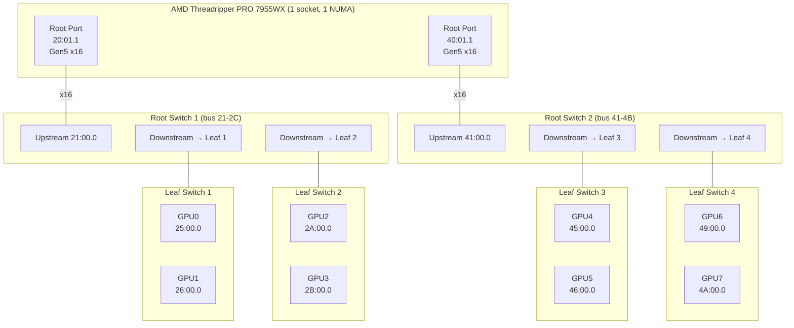

# ASRock WRX90 WS EVO with c-payne Microchip Switchtec Switches

PCIe topology analysis, P2P performance measurements, and inference AllReduce benchmarks for a custom 8× RTX PRO 6000 Blackwell build using ASRock WRX90 WS EVO motherboard with 3× c-payne Microchip Switchtec PCIe Gen5 switches in a hierarchical root-switch + leaf-switch topology.

## Table of Contents

- [System Overview](#system-overview)
- [Physical PCIe Topology](#physical-pcie-topology)
- [P2P Bandwidth Results](#p2p-bandwidth-results)
- [P2P Latency Results](#p2p-latency-results)
- [p2pmark Benchmark Results](#p2pmark-benchmark-results)
- [PCIe Oneshot AllReduce Crossover](#pcie-oneshot-allreduce-crossover)
- [Multi-Flow Scaling Analysis](#multi-flow-scaling-analysis)
- [No Posted-Write Collapse](#no-posted-write-collapse)
- [Comparison with Other Topologies](#comparison-with-other-topologies)
- [Hardware Configuration Notes](#hardware-configuration-notes)

---

## System Overview

| Component | Detail |
|---|---|
| **Motherboard** | ASRock WRX90 WS EVO |
| **CPU** | AMD Ryzen Threadripper PRO 7955WX 16-Core (1 socket) |
| **NUMA** | 1 node (all 8 GPUs on NUMA 0) |
| **RAM** | 256 GB DDR5-5600 |
| **GPUs** | 8× NVIDIA RTX PRO 6000 Blackwell Server Edition (96 GB GDDR7) |
| **PCIe Switches** | 3× c-payne Microchip Switchtec Gen5 (vendor 1f18:0101) |
| **PCIe Link** | Gen5 x16 per GPU (32 GT/s, ~63 GB/s theoretical) |
| **Kernel** | 6.17.0-19-generic |
| **Driver** | NVIDIA 595.45.04 (open) |
| **CUDA** | 13.2 (V13.2.51) |
| **Kernel params** | `mitigations=off amd_iommu=off iommu=off` |

---

## Physical PCIe Topology

The system uses a **hierarchical root-switch + leaf-switch** topology. Unlike partitioned Broadcom switches, the Microchip Switchtec root switch provides **direct GPU-to-GPU fabric routing** between all leaf switches — traffic never needs to traverse CPU root ports for P2P.



### nvidia-smi Topology

```
$ nvidia-smi topo -m
        GPU0  GPU1  GPU2  GPU3  GPU4  GPU5  GPU6  GPU7
GPU0     X    PIX   PXB   PXB   NODE  NODE  NODE  NODE
GPU1    PIX    X    PXB   PXB   NODE  NODE  NODE  NODE
GPU2    PXB   PXB    X    PIX   NODE  NODE  NODE  NODE
GPU3    PXB   PXB   PIX    X    NODE  NODE  NODE  NODE
GPU4    NODE  NODE  NODE  NODE   X    PIX   PXB   PXB
GPU5    NODE  NODE  NODE  NODE  PIX    X    PXB   PXB
GPU6    NODE  NODE  NODE  NODE  PXB   PXB    X    PIX
GPU7    NODE  NODE  NODE  NODE  PXB   PXB   PIX    X
```

| Code | Meaning | Hops | Measured BW |
|---|---|---|---|
| **PIX** | Same leaf switch | 1 | 55 GB/s |
| **PXB** | Cross-leaf, same root switch | 3 | 55 GB/s |
| **NODE** | Cross root switch, through CPU | 5+ | 55 GB/s |

> **Key finding:** All topology tiers achieve **identical bandwidth** (~55 GB/s). GPU-to-GPU P2P traffic routes entirely through the switch fabric and **never traverses CPU root ports** — verified by uplink degradation test (see below).

---

## P2P Bandwidth Results

### Bidirectional P2P=Enabled Bandwidth Matrix (GB/s)

From CUDA `p2pBandwidthLatencyTest`:

```
   D\D     0      1      2      3      4      5      6      7
     0    —    104    104    105    104    104    104    103
     1   104    —     103    103    104    104    104    103
     2   103   103     —     104    103    103    104    103
     3   104   103    104     —     103    104    104    103
     4   104   104    103    104     —     103    104    104
     5   103   103    103    103    103     —     104    104
     6   104   103    103    105    104    103     —     103
     7   104   103    103    104    104    104    103     —
```

**Completely uniform** — every pair achieves 103–105 GB/s bidirectional regardless of topology tier. No asymmetry.

### Unidirectional P2P Write Bandwidth

```
   D\D     0      1      2      3      4      5      6      7
     0    —     55.0   55.0   54.5   54.7   54.9   54.4   55.7
     1   55.2    —     54.2   55.4   55.0   54.0   54.5   55.4
     2   55.8   54.6    —     54.2   54.3   56.4   53.7   53.9
     3   55.0   54.6   54.7    —     54.0   55.0   54.4   56.0
     4   54.4   54.6   54.0   54.4    —     54.3   54.3   54.3
     5   54.4   54.6   53.7   54.8   54.8    —     55.2   55.1
     6   54.8   54.5   55.6   55.8   54.8   54.1    —     54.9
     7   55.0   55.6   55.5   54.1   55.3   55.9   55.6    —
```

All pairs: **53.7–56.4 GB/s** (85–90% of Gen5 x16 theoretical 63 GB/s).

---

## P2P Latency Results

### P2P=Enabled Write Latency (microseconds)

From CUDA `p2pBandwidthLatencyTest`:

```
   GPU     0      1      2      3      4      5      6      7
     0   1.29   0.47   0.45   0.46   0.52   0.53   0.47   0.51
     1   0.53   1.32   0.53   0.47   0.46   0.53   0.53   0.46
     2   0.46   0.45   1.24   0.51   0.47   0.53   0.46   0.52
     3   0.52   0.46   0.46   1.25   0.53   0.47   0.47   0.46
     4   0.46   0.45   0.46   0.52   1.27   0.46   0.53   0.53
     5   0.46   0.52   0.45   0.53   0.46   1.23   0.47   0.52
     6   0.47   0.46   0.45   0.46   0.47   0.53   1.22   0.52
     7   0.46   0.46   0.53   0.47   0.53   0.46   0.45   1.24
```

All GPU pairs: **0.45–0.53 µs**. Completely uniform — no topology-dependent latency difference.

### p2pmark Latency (128-byte remote reads, 10000 iterations)

```
PIX  (same leaf):         0.71 µs
PXB  (cross-leaf):        0.71–0.73 µs
NODE (cross root switch): 1.14–1.18 µs
```

Under concurrent load (all 8 GPUs reading all 7 peers simultaneously): **6.56 µs effective latency**.

---

## p2pmark Benchmark Results

All results measured with [p2pmark](https://github.com/lukealonso/p2pmark) version `3c39f36`.

### Scores

| Config | PCIe Link Score | Interconnect Score | Effective Latency |
|---|---|---|---|
| **4 GPU** | **0.87** (55.0 GB/s) | **0.57** (126 / 220 GB/s) | — |
| **8 GPU** | **0.87** (54.8 GB/s) | **0.45** (196 / 439 GB/s) | 6.56 µs |

### Comparison with Other Systems

| System | GPUs | PCIe Score | Interconnect (all-to-all/ideal) | All-to-all BW |
|---|---|---|---|---|
| **This system (c-payne)** | 8 | **0.87** | **0.45** (196 / 439 GB/s) | **196 GB/s** |
| [ASUS ESC8000A-E13P (Broadcom)](asus-esc8000a-e13p-broadcom-switches.md) | 8 | 0.85 | 0.12 (52 / 429 GB/s) | 52 GB/s |
| luke (3× Microchip switches) | 8 | 0.86 | 0.44 (192 / 435 GB/s) | 192 GB/s |
| Festr (dual Turin, direct-attach) | 8 | 0.84 | 0.41 (173 / 421 GB/s) | 173 GB/s |

### Topology Probe (8 GPU, staggered distance)

```
+1: 51.55 GB/s avg (413 total)   ← neighbors
+2: 39.17 GB/s avg (313 total)
+3: 32.84 GB/s avg (263 total)
+4: 25.63 GB/s avg (205 total)   ← max distance
+5: 32.82 GB/s avg (263 total)
+6: 39.21 GB/s avg (314 total)
+7: 51.53 GB/s avg (412 total)   ← wrapping neighbors
```

---

## PCIe Oneshot AllReduce Crossover

Auto-tuned at SGLang startup with [luke's PCIe oneshot allreduce](https://github.com/lukealonso/sglang/commit/d39236aee635cca2725f94539358da0d1c85d8c2), TP=4, bf16:

| Size | Custom (µs) | NCCL (µs) | Winner |
|---|---|---|---|
| 1 KB | 7.5 | 32.3 | Custom 4.3× |
| 4 KB | 7.9 | 32.0 | Custom 4.1× |
| 16 KB | 11.6 | 32.2 | Custom 2.8× |
| 32 KB | 16.3 | 32.7 | Custom 2.0× |
| 64 KB | 24.6 | 33.3 | Custom 1.4× |
| 96 KB | 32.3 | 33.8 | Custom 1.0× |
| 120 KB | 37.6 | 53.6 | Custom 1.4× |
| 128 KB | 40.1 | 35.2 | **NCCL wins** |
| 512 KB | 128.0 | 101.7 | NCCL 1.3× |

Crossover at **120 KB**. Auto-tuner sets `max_size = 120KB`.

### Comparison: Crossover on Different Topologies

| System | Crossover | Custom advantage range |
|---|---|---|
| This system (c-payne) | 120 KB | 1.4–4.3× for 1–120 KB |
| [ASUS ESC8000A-E13P (Broadcom)](asus-esc8000a-e13p-broadcom-switches.md) | 512 KB | 1.4–2.2× for 1–512 KB |

The Broadcom system has higher crossover because its NCCL baseline is slower (uses SHM for NODE pairs). On this system NCCL is faster overall, so custom wins only up to 120 KB.

---

## Multi-Flow Scaling Analysis

### Bandwidth Scaling by Flow Count

| Flows | Config | Total BW | Per-flow |
|---|---|---|---|
| 1 | PIX (same leaf) | 53.9 GB/s | 53.9 |
| 2 | PIX (diff leaf switches) | 108.3 GB/s | 54.2 |
| 2 | PXB (cross-leaf) | 108.6 GB/s | 54.3 |
| 2 | NODE (cross-root switch) | 108.7 GB/s | 54.3 |
| 4 | NODE 1:1 | 108.6 GB/s | 27.2 |
| 16 | Cross-root | 99.6 GB/s | 6.2 |
| 56 | All-to-all | 232.8 GB/s | 4.2 |

### GPU DS Port Isolation

| Test | Total BW | Notes |
|---|---|---|
| Same GPU: GPU0→GPU4 + GPU0→GPU2 | 53.9 GB/s | DS port shared |
| Diff GPU: GPU0→GPU4 + GPU1→GPU2 | 107.0 GB/s | Independent, perfect scaling |

---

## No Posted-Write Collapse

Unlike the [Broadcom PEX890xx](asus-esc8000a-e13p-broadcom-switches.md#pex890xx-posted-write-arbitration-bug), the Microchip Switchtec switches show **no posted-write arbitration collapse** under any flow pattern:

| Test | Write BW | Read BW | Status |
|---|---|---|---|
| GPU0→GPU4 + GPU1→GPU6 (same leaf → diff dest) | **53.9 GB/s** | 55.0 GB/s | **OK** |
| GPU0→GPU4 + GPU1→GPU5 (same leaf → same dest) | 54.5 GB/s | 56.7 GB/s | OK |
| GPU0→GPU4 + GPU2→GPU6 (diff leaf → diff dest) | 107.8 GB/s | 108.0 GB/s | OK |

On the Broadcom system, the first test pattern collapses to **2.7 GB/s**. On c-payne Microchip switches: **53.9 GB/s** — no collapse whatsoever.

### Uplink Degradation Proof

To verify P2P routes through switch fabric (not CPU root ports), we degraded uplinks to Gen2:

| Path | Gen5 (normal) | Gen2 (uplink degraded) | Uses uplink? |
|---|---|---|---|
| PIX (same leaf) | 54.4 GB/s | **54.2 GB/s** (unchanged) | **NO** |
| PXB (cross-leaf, same root sw) | 54.2 GB/s | **54.1 GB/s** (unchanged) | **NO** |
| NODE (cross root switch) | 54.5 GB/s | **54.7 GB/s** (unchanged!) | **NO** |

**All traffic stays within the switch fabric.** Even cross-root-switch traffic (GPU0→GPU4) is unaffected by CPU uplink degradation — the root switch routes it directly between leaf switches.

---

## Comparison with Other Topologies

| Metric | c-payne Switchtec (this) | Broadcom PEX890xx | Turin direct-attach |
|---|---|---|---|
| **Architecture** | Root switch + leaf switches | Partitioned (2 VS/chip) | Direct to CPU |
| **Single-flow BW** | 55 GB/s (all pairs) | 54 same-chip / 38 cross-chip | 55 same-NUMA / 45 cross |
| **8-GPU all-to-all** | **196 GB/s** | 52 GB/s | 190 GB/s |
| **Posted-write collapse** | **None** | 2.7 GB/s under trigger | None |
| **1:1 latency** | 0.45–0.53 µs | 0.71–0.74 µs same / 1.3 µs cross | 0.76–0.84 µs |
| **Concurrent latency** | 6.56 µs | 7.39 µs | 3.28 µs |
| **Uniform bandwidth** | **Yes** (all pairs equal) | No (38 vs 54) | No (45 vs 55) |
| **GPU traffic through CPU** | **No** | Yes (cross-chip) | Yes (all pairs) |
| **NCCL ring bottleneck** | None | Cross-chip 38 GB/s | Cross-NUMA 45 GB/s |

### Why c-payne Switchtec Outperforms

1. **Root switch provides direct GPU-to-GPU fabric** — no CPU root port involvement
2. **No posted-write arbitration bug** — all flow patterns work correctly
3. **Single NUMA** — no xGMI overhead, no cross-NUMA penalty
4. **Uniform bandwidth** — NCCL ring has no weak link

### Where Turin Direct-Attach Wins

- **Concurrent small-message latency**: 3.28 µs vs 6.56 µs (2× better)
- This is because each GPU has a dedicated root port with lower arbitration overhead for small packets under high concurrency

---

## Hardware Configuration Notes

### ACS (Access Control Services)

ACS `ReqRedir` is **disabled** on all devices (0 out of 29 with ReqRedir+). No manual ACS disable needed on this system — the Microchip switches do not enforce ACS redirect by default.

### MaxReadReq

| Device | MaxReadReq | MaxPayload |
|---|---|---|
| Switch ports | 128 bytes (same as Broadcom) | 256 bytes |
| GPU endpoints | 512 bytes | 256 bytes |
| CPU root ports | 512 bytes | 256 bytes |

### Switch Firmware

- Vendor: 1f18 (Microchip)
- Device: 0101
- All links: Gen5 x16 (32 GT/s)
- Management endpoints (Memory controller class): 21:00.1, 23:00.1, 47:00.1

### PCIe Link Status

All GPU and switch upstream links train to **Gen5 x16** (32 GT/s). Downstream ports to idle GPUs fall back to Gen1 (2.5 GT/s) for power saving — this is normal and does not affect performance under load.
