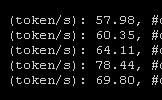
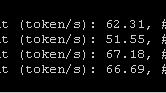

# GLM-5 on RTX PRO 6000 Blackwell (SM120)

## Table of Contents

- [Overview](#overview)
- [Hardware Requirements](#hardware-requirements)
- [NVFP4 Quantization](#nvfp4-quantization)
- [Why SGLang Only (vLLM Does Not Work)](#why-sglang-only-vllm-does-not-work)
- [BF16 KV Cache Mandatory](#bf16-kv-cache-mandatory)
- [NCCL Environment Variables](#nccl-environment-variables)
- [Docker Images](#docker-images)
- [SGLang Launch Commands](#sglang-launch-commands)
- [MTP / Speculative Decoding](#mtp--speculative-decoding)
- [Required Patches for glm5-blackwell Docker](#required-patches-for-glm5-blackwell-docker)
- [FlashInfer CUTLASS Race Condition Fix](#flashinfer-cutlass-race-condition-fix)
- [Power Consumption](#power-consumption)
- [Benchmark Results](#benchmark-results)
- [Memory Usage](#memory-usage)
- [TP/PP Configurations](#tppp-configurations)
- [SM120 Architecture Limitations](#sm120-architecture-limitations)
- [All Errors and Fixes](#all-errors-and-fixes)
- [Related PRs](#related-prs)

---

## Overview

| Parameter | Value |
|-----------|-------|
| Model | `zai-org/GLM-5` |
| Total parameters | 744B |
| Active parameters | 40B |
| Architecture | MoE with DeepSeek Sparse Attention (DSA), MLA-based |
| Experts | 256 total, 8 activated per token |
| MTP layer | Layer 78 (~19 GB in BF16 precision) |
| SWE-bench Verified | 77.8 (vs Qwen 72.0) |
| Inference engine | **SGLang only** (vLLM does not work on SM120) |
| Minimum GPUs | **8x RTX PRO 6000** (768 GB VRAM) |

GLM-5 is a 744B MoE model with DeepSeek Sparse Attention. On SM120 (RTX PRO 6000 Blackwell), SGLang bypasses all DSA backends and runs GLM-5 as if it were a DeepSeek V3.1 model -- using MLA kernels that ignore the sparsity mask. This is "backwards compatible" since the training-time indexer would have masked out irrelevant tokens, so computing full attention is slightly wasteful but not accuracy-degrading.

---

## Hardware Requirements

### Minimum: 8x RTX PRO 6000 (768 GB VRAM)

- NVFP4 weights: ~440 GB (57.06 GB per GPU across 8 GPUs)
- **Cannot fit on 4x RTX PRO 6000** (only 384 GB total VRAM)
- Minimum viable: **6x RTX PRO 6000** using `--tp 2 --pp 3`

### Reference configurations

| Component | Details |
|-----------|---------|
| GPUs | 8x NVIDIA RTX PRO 6000 Blackwell 96 GB (SM120) |
| Total VRAM | 768 GB |
| RAM | 1.5 TB recommended |
| CPU topology | 2x NUMA nodes: GPU0-3 on NUMA0, GPU4-7 on NUMA1 |
| Tested CPUs | Genoa (EPYC 9004) and Turin (EPYC 9005) |
| Driver | 590.48.01 (CUDA 13.1) |

---

## NVFP4 Quantization

### Available checkpoints

| Checkpoint | MTP | Disk Size | Notes |
|---|---|---|---|
| `lukealonso/GLM-5-NVFP4` | **No** | ~410 GB | Original quant, no MTP weights |
| `festr2/GLM-5-NVFP4-MTP` | **Yes** (BF16) | ~410 GB + 19 GB | MTP layer 78 restored from BF16 checkpoint |
| `QuantTrio/GLM-5-AWQ` | -- | ~420 GB | Fails with OOM during weight loading; NVFP4 is superior |

### Quantization details

- 4-bit blockwise with FP8 scales via NVIDIA Model Optimizer
- SGLang flag: `--quantization modelopt_fp4`
- VRAM for weights: ~57 GB per GPU on TP8
- MMLU accuracy: **0.873** (official BF16 benchmark: 0.877, gap of only -0.004)

### Accuracy concern at long context

~10% accuracy drops observed at 100K+ context lengths in MMLU testing.

---

## Why SGLang Only (vLLM Does Not Work)

**GLM-5 does NOT work on vLLM for SM120** as of 2026-03-08.

The error:
```
ValueError: No valid attention backend found for cuda with
AttentionSelectorConfig(head_size=576, dtype=torch.bfloat16, kv_cache_dtype=auto,
use_mla=True, use_sparse=True, ...)
```

Root causes:
1. No vLLM attention backend supports MLA + sparse attention + SM120 simultaneously
2. GLM-5 uses `qk_nope_head_dim == 192` (FlashInfer MLA requires 128)
3. NVFP4 support keeps breaking in vLLM

SGLang works by bypassing all DSA (DeepSeek Sparse Attention) backends entirely and running GLM-5 in non-DSA mode using FlashInfer FA2 MLA kernels that are SM120-compatible.

Grimulkan has a plan to port GLM-5 to vLLM:
1. Pull FlashInfer FA2 bf16 and XQA fp8 MLA kernels from SGLang into vLLM
2. Wire GLM-5 in non-DSA mode
3. Fix NVFP4 MoE GEMM + DCP compatibility
4. Use normal FA2 for prefill
5. Enable MTP head (already exists in vLLM)

---

## BF16 KV Cache Mandatory

**FP8 KV cache (`--kv-cache-dtype fp8_e4m3`) does NOT work on SM120.** It produces garbled output or emits 1 token and stops.

The root cause is that luke had a local patch for KV scales in the FlashInfer backend (passing FP8 dequantization scales in the ragged+paged split path). Without those scales, the cached KV prefix is read back without undoing the scale division.

**Always use:**
```bash
--kv-cache-dtype bf16
```

This limits practical context to ~200K tokens (vs potentially more with FP8), but is the only working option.

---

## NCCL Environment Variables

### Required NCCL settings

```bash
export NCCL_IB_DISABLE=1               # No InfiniBand
export NCCL_P2P_LEVEL=SYS              # or PHB for same-NUMA only
export NCCL_ALLOC_P2P_NET_LL_BUFFERS=1
export NCCL_MIN_NCHANNELS=8
```

### NCCL graph optimization (for Genoa/Turin with cross-NUMA)

```bash
wget https://www.voipmonitor.org/nccl_graph_opt.xml -O /mnt/nccl_graph_opt.xml
export NCCL_GRAPH_FILE=/mnt/nccl_graph_opt.xml
```

This tricks NCCL into using the low-latency (LL) protocol for small messages across NUMA nodes. Measured **+11% throughput improvement** on Genoa with 2 NUMA nodes and 4 GPUs per node.

Alternative (simpler but less optimal): `export NCCL_PROTO=LL`

### Other environment variables

```bash
export OMP_NUM_THREADS=8
export SAFETENSORS_FAST_GPU=1
export NVIDIA_TF32_OVERRIDE=1
export PYTORCH_CUDA_ALLOC_CONF=expandable_segments:True
export FLASHINFER_DISABLE_VERSION_CHECK=1
export NCCL_CUMEM_HOST_ENABLE=0

# Critical for GLM-5:
export SGLANG_ENABLE_JIT_DEEPGEMM=0     # DeepGemm not supported on SM120
export SGLANG_ENABLE_DEEP_GEMM=0        # Fully disable DeepGemm fallback
export SGLANG_ENABLE_SPEC_V2=True       # MANDATORY for MTP (see MTP section)
```

### Kernel boot parameter

If NCCL P2P hangs occur:
```
iommu=pt
amd_iommu=pt    # on AMD platforms
```

---

## Docker Images

### Recommended: voipmonitor nightly

```bash
docker pull voipmonitor/llm-pytorch-blackwell:nightly
```

Custom image by Festr containing:
- SGLang compiled from source with SM120 patches
- PyTorch 2.12, latest FlashInfer, CUTLASS 4.4.1, cuDNN 91901
- SM_120f compilation target enabled
- Pre-generated Triton MoE kernel configs for RTX PRO 6000 Blackwell Server Edition

### Docker run command

```bash
docker run -it --rm \
    --entrypoint /bin/bash \
    --gpus all \
    --ipc=host \
    --shm-size=8g \
    --ulimit memlock=-1 \
    --ulimit stack=67108864 \
    --network host \
    --cpuset-cpus "0-63" \
    -v /root/.cache/huggingface:/root/.cache/huggingface \
    -v /mnt:/mnt \
    -v vllm-nightly-jit:/cache/jit \
    voipmonitor/llm-pytorch-blackwell:nightly
```

### Alternative images

| Image | Notes |
|---|---|
| `lmsysorg/sglang:dev-cu13` | Official SGLang nightly, CUDA 13.0. Needs `pip install --upgrade transformers` inside. |
| `lmsysorg/sglang:glm5-blackwell` | Official GLM5-specific image. Built for SM90/SM100 -- **broken on SM120 without patches** (see patches section). |
| `voipmonitor/llm-pytorch-blackwell:nightly-fp4-prezero` | Experimental build with FlashInfer pre-zero fix. |

### Patching the official dev-cu13 image (orangezed's Dockerfile)

```dockerfile
# sglang dev-cu13 nightly pulled 2026-03-04
FROM lmsysorg/sglang@sha256:426d1fa4b10722688678b99d817c2caa92a89eed4a8ee2927ab44a848bbe77df

RUN pip install --no-cache-dir transformers==5.2.0

# Fix DeepGemm scale format detection for NVFP4 models on Blackwell (SM120)
# NVFP4 uses float8_e4m3fn scales, not ue8m0 -- hardcoded True causes NaN
RUN sed -i "s/DEEPGEMM_SCALE_UE8M0 = DEEPGEMM_BLACKWELL/DEEPGEMM_SCALE_UE8M0 = False/" \
    /sgl-workspace/sglang/python/sglang/srt/layers/deep_gemm_wrapper/configurer.py
```

---

## SGLang Launch Commands

### Best known working command (with MTP)

```bash
SGLANG_ENABLE_SPEC_V2=True \
SGLANG_ENABLE_JIT_DEEPGEMM=0 \
SGLANG_ENABLE_DEEP_GEMM=0 \
NCCL_GRAPH_FILE=/mnt/nccl_graph_opt.xml \
NCCL_IB_DISABLE=1 \
NCCL_P2P_LEVEL=SYS \
NCCL_ALLOC_P2P_NET_LL_BUFFERS=1 \
NCCL_MIN_NCHANNELS=8 \
OMP_NUM_THREADS=8 \
SAFETENSORS_FAST_GPU=1 \
python3 -m sglang.launch_server \
  --model-path /mnt/GLM-5-NVFP4-MTP \
  --tp 8 \
  --trust-remote-code \
  --attention-backend flashinfer \
  --moe-runner-backend cutlass \
  --kv-cache-dtype bf16 \
  --tool-call-parser glm47 \
  --reasoning-parser glm45 \
  --quantization modelopt_fp4 \
  --disable-custom-all-reduce \
  --enable-flashinfer-allreduce-fusion \
  --mem-fraction-static 0.85 \
  --cuda-graph-max-bs 32 \
  --host 0.0.0.0 \
  --port 5000 \
  --served-model-name glm-5 \
  --max-running-requests 64 \
  --model-loader-extra-config '{"enable_multithread_load": true, "num_threads": 8}' \
  --speculative-algorithm NEXTN \
  --speculative-num-steps 3 \
  --speculative-num-draft-tokens 4 \
  --speculative-eagle-topk 1 \
  --enable-metrics
```

### Without MTP (stable baseline)

```bash
NCCL_GRAPH_FILE=/mnt/nccl_graph_opt.xml \
NCCL_IB_DISABLE=1 \
NCCL_P2P_LEVEL=SYS \
NCCL_ALLOC_P2P_NET_LL_BUFFERS=1 \
NCCL_MIN_NCHANNELS=8 \
OMP_NUM_THREADS=8 \
SAFETENSORS_FAST_GPU=1 \
python3 -m sglang.launch_server \
  --model-path lukealonso/GLM-5-NVFP4 \
  --tp 8 \
  --trust-remote-code \
  --attention-backend flashinfer \
  --moe-runner-backend flashinfer_cutlass \
  --kv-cache-dtype bf16 \
  --tool-call-parser glm47 \
  --reasoning-parser glm45 \
  --quantization modelopt_fp4 \
  --disable-custom-all-reduce \
  --enable-flashinfer-allreduce-fusion \
  --mem-fraction-static 0.9 \
  --cuda-graph-max-bs 8 \
  --host 0.0.0.0 \
  --port 5000 \
  --served-model-name glm-5 \
  --max-running-requests 8 \
  --model-loader-extra-config '{"enable_multithread_load": true, "num_threads": 8}'
```

### Docker Compose example (orangezed)

```yaml
services:
  sglang-glm5:
    build: .
    image: sglang-glm5:latest
    container_name: sglang-glm5-nightly
    runtime: nvidia
    environment:
      - NVIDIA_VISIBLE_DEVICES=0,1,2,3,4,5,6,7
      - CUDA_DEVICE_ORDER=PCI_BUS_ID
      - NCCL_IB_DISABLE=1
      - NCCL_P2P_LEVEL=SYS
      - NCCL_ALLOC_P2P_NET_LL_BUFFERS=1
      - NCCL_MIN_NCHANNELS=8
      - OMP_NUM_THREADS=8
      - SAFETENSORS_FAST_GPU=1
      - NCCL_CUMEM_HOST_ENABLE=0
      - FLASHINFER_DISABLE_VERSION_CHECK=1
      - PYTORCH_CUDA_ALLOC_CONF=expandable_segments:True
    volumes:
      - /mnt/raid0/models:/models:ro
      - huggingface-cache:/root/.cache/huggingface
    ports:
      - "8003:5000"
    command:
      - python3
      - -m
      - sglang.launch_server
      - --model-path=/models/festr2/GLM-5-NVFP4-MTP
      - --served-model-name=glm-5
      - --reasoning-parser=glm45
      - --tool-call-parser=glm47
      - --trust-remote-code
      - --tp=8
      - --mem-fraction-static=0.9
      - --max-running-requests=64
      - --kv-cache-dtype=bf16
      - --quantization=modelopt_fp4
      - --attention-backend=flashinfer
      - --moe-runner-backend=deep_gemm
      - --disable-custom-all-reduce
      - --cuda-graph-max-bs=32
      - --host=0.0.0.0
      - --port=5000
      - '--model-loader-extra-config={"enable_multithread_load": true, "num_threads": 8}'
      - --speculative-algorithm=EAGLE
      - --speculative-num-steps=3
      - --speculative-eagle-topk=1
      - --speculative-num-draft-tokens=4
    cpuset: "0-63"
    ipc: host
    shm_size: "8g"
    ulimits:
      memlock: -1
      stack: 67108864
```

### Launch parameter reference

| Parameter | Reason |
|-----------|--------|
| `--quantization modelopt_fp4` | Required for NVFP4 checkpoint |
| `--kv-cache-dtype bf16` | **Mandatory on SM120** -- fp8_e4m3 produces garbled output |
| `--tp 8` | All 8 GPUs required; model is 57 GB/GPU before KV cache |
| `--attention-backend flashinfer` | Architecture-independent; flashmla/trtllm are SM90/SM100 only |
| `--moe-runner-backend cutlass` | Fastest for MTP speculative decoding |
| `--disable-custom-all-reduce` | Custom allreduce is optimized for NVLink; PCIe only on RTX PRO |
| `--enable-flashinfer-allreduce-fusion` | Fuses allreduce with attention -- measurable throughput gain |
| `--mem-fraction-static 0.85-0.92` | Leave 7-15 GB for CUDA workspace per GPU |
| `SGLANG_ENABLE_JIT_DEEPGEMM=0` | DeepGemm not supported on SM120 |
| `SGLANG_ENABLE_DEEP_GEMM=0` | Fully disables DeepGemm fallback path |
| `SGLANG_ENABLE_SPEC_V2=True` | **Critical for MTP** -- without it, NEXTN falls back to EAGLE and loads model twice (OOM) |

---

## MTP / Speculative Decoding

### Configuration

```bash
# Environment variable (MANDATORY):
SGLANG_ENABLE_SPEC_V2=True

# Launch flags:
--speculative-algorithm NEXTN
--speculative-num-steps 3
--speculative-num-draft-tokens 4
--speculative-eagle-topk 1
```

**WARNING:** `SGLANG_ENABLE_SPEC_V2=True` is **mandatory**. Without it, SGLang silently converts NEXTN to EAGLE and loads the full model a second time as a draft model -- instant OOM (57 GB x 2 = 114 GB per GPU on a 96 GB card).

### MTP model checkpoint

- **Use:** `festr2/GLM-5-NVFP4-MTP` (HuggingFace)
- Created by Festr by restoring MTP heads from BF16 checkpoint to the NVFP4 quant
- MTP layer is layer 78, kept in BF16 precision (~19 GB)
- FP8 MTP is possible but not recommended (decreases accept rate)
- The original `lukealonso/GLM-5-NVFP4` does **not** include MTP weights

### Performance impact

MTP roughly **doubles throughput** over the non-MTP baseline:

- Accept rate: 0.55-0.94 (varies by context)
- Accept length: 2.19-2.80 tokens
- Without MTP: 35-50 tok/s
- With MTP: 70-105 tok/s

### MoE runner backend comparison for MTP

| Backend | Performance | Notes |
|---|---|---|
| `--moe-runner-backend cutlass` | Fastest | Best for MTP speculative decoding |
| `--moe-runner-backend flashinfer_cutlass` | Slightly slower | Default fallback |
| `--moe-runner-backend deep_gemm` | Falls back to cutlass | DeepGemm not supported on SM120; misleading in logs |

---

## Required Patches for glm5-blackwell Docker

If using the official `lmsysorg/sglang:glm5-blackwell` image (built for SM90/SM100), three patches are required for SM120:

### Patch 1: server_args.py

Forces KV cache dtype to bfloat16 for DSA on SM120. Overrides NSA prefill backend from `flashmla_sparse` to `flashinfer`. Overrides NSA decode backend from `trtllm` to `flashinfer`.

Target: `/usr/local/lib/python3.12/dist-packages/sglang/srt/server_args.py`

### Patch 2: nsa_backend.py

Wraps `deep_gemm.get_paged_mqa_logits_metadata()` in try/except. Falls back to None metadata on SM120, forcing the FlashInfer path.

Target: `/usr/local/lib/python3.12/dist-packages/sglang/srt/layers/attention/nsa_backend.py`

### Patch 3: nsa_indexer.py

Adds SM120 detection for dynamic head_dim with bfloat16 KV cache.

Target: `/usr/local/lib/python3.12/dist-packages/sglang/srt/layers/attention/nsa_indexer.py`

Full patch scripts are available in the deployment guide: `glm-5/images/1478868208835629201_GLM5_NVFP4_Blackwell_deployment_guide.md`

### DeepGemm scale fix

For NVFP4 on SM120, the DeepGemm scale format detection is wrong. NVFP4 uses `float8_e4m3fn` scales, not `ue8m0`. The hardcoded `True` causes NaN:

```bash
sed -i "s/DEEPGEMM_SCALE_UE8M0 = DEEPGEMM_BLACKWELL/DEEPGEMM_SCALE_UE8M0 = False/" \
    /sgl-workspace/sglang/python/sglang/srt/layers/deep_gemm_wrapper/configurer.py
```

---

## FlashInfer CUTLASS Race Condition Fix

A race condition in the FlashInfer CUTLASS FP4 GEMM kernel produces NaN values, causing crashes.

### Symptoms

```
/pytorch/aten/src/ATen/native/cuda/TensorCompare.cu:112: _assert_async_cuda_kernel:
Assertion `probability tensor contains either `inf`, `nan` or element < 0` failed.
```

Or: CUDA device-side assert triggered in `eagle_worker_v2.py:510 _zero_fill_draft_kv_for_cached_prefix`

### Root cause

FlashInfer CUTLASS FP4 GEMM kernel race condition. Fix: https://github.com/flashinfer-ai/flashinfer/pull/2716

### Workarounds (in order of preference)

1. **Upgrade to CUTLASS 4.4.1** and rebuild FlashInfer JIT cache (`rm -rf /cache/jit/*`). Use `voipmonitor/llm-pytorch-blackwell:nightly` which includes this fix.
2. Use `--fp4-gemm-backend flashinfer_cudnn` instead of flashinfer_cutlass
3. Use `--enable-nan-detection` (prevents crash but may produce garbage tokens)
4. Apply luke's sampler patch (validates/fixes probabilities before multinomial sampling)

**Important:** When upgrading Docker images, the old JIT kernel cache must be wiped for the fix to take effect:

```bash
rm -rf /cache/jit/*
```

---

## Power Consumption

GLM-5 draws significantly more power than other models:

| Phase | Power per Card | Notes |
|---|---|---|
| Decode | ~300W | Sustained |
| Prefill | 400-600W | Peaking at **640W** observed |
| Prefill (all 8 cards) | 600W each | All cards hit 600W simultaneously |

Plan cooling and PSU capacity accordingly. An 8-GPU setup draws up to **4,800W** from GPUs alone during prefill.

---

## Benchmark Results

### Decode throughput (tok/s) -- single batch

| Configuration | 0 Context | 15K Context | 100K Context | 200K Context |
|---|---|---|---|---|
| NVFP4, no MTP (luke, early) | ~50 | -- | -- | -- |
| NVFP4, no MTP (Festr/JTazz) | 35-44 | 30 | -- | -- |
| NVFP4 + MTP (EAGLE) | 70-105 | -- | 60-80 | -- |
| NVFP4 + MTP (latest, Festr) | ~100 | -- | 60-80 | ~50 |
| NVFP4 + MTP (orangezed) | 97.2 | -- | -- | -- |

### Concurrent throughput (with MTP)

- 3 running requests: **133-135 tok/s** generation throughput (accept rate 0.55-0.70)
- Accept length: 2.19-2.80 tokens

### Prefill throughput

- Single batch prefill: **~4,000 tok/s**

### Startup time

| Phase | Duration |
|---|---|
| Model load (multithread, 8-16 threads) | ~36 seconds |
| CUDA graph capture | ~208 seconds |
| **Total startup** | **~7-8 minutes** |

### FP8 KV cache speed (broken, for reference)

FP8 KV cache: 20 tok/s (vs 90 tok/s with bf16 KV cache) -- confirmed broken on SM120.




---

## Memory Usage

### Per-GPU breakdown (8x TP8, NVFP4 + MTP)

| Component | Size |
|-----------|------|
| Weights (NVFP4) | 57.06 GB per GPU |
| KV Cache (bf16) | 29.32 GB per GPU |
| Total allocated | ~86.38 GB per GPU |
| Available after allocation | 7.43-7.53 GB per GPU |

### KV cache capacity

| mem-fraction-static | Total KV Tokens | Max Context |
|---|---|---|
| 0.92 | 314,304 | ~202,752 |
| 0.85 | Slightly less | ~190,000 |

BF16 KV cache limits practical context to ~200K tokens. FP8 KV cache would allow more but is broken on SM120.

---

## TP/PP Configurations

| GPUs | Configuration | Status |
|------|--------------|--------|
| 8x | `--tp 8` | **Primary configuration**, well tested |
| 6x | `--tp 2 --pp 3` | Reported viable, less tested |
| 4x | N/A | **Too large** -- NVFP4 weights alone are 440 GB |

---

## SM120 Architecture Limitations

### What SM120 lacks vs SM90/SM100

- **No TMEM** (Tensor Memory)
- **No TCGEN05** instructions
- **No WGMMA** instructions
- Shorter shared memory / register file
- Cannot run DeepGemm (requires WGMMA for SM90, TCGEN05 for SM100)
- Cannot run FlashAttention 3+ (based on TMEM/TCGEN05)
- Cannot run FlashMLA Sparse natively
- Limited to FlashAttention 2 via SM89 kernels

### How SGLang runs GLM-5 on SM120

SGLang bypasses all DSA backends and runs GLM-5 as a DeepSeek V3.1 model:
- Uses MLA kernels ignoring sparsity (FlashInfer FA2 variant)
- DSA indexer is not invoked
- Computes attention on all tokens (including those DSA would have masked)
- This is backwards compatible -- slightly wasteful but not accuracy-degrading

### Available SM120 MLA kernels in SGLang

1. FlashInfer FA-based BF16 MLA kernel (SM120 specific)
2. XQA FP8 MLA kernel (SM120 specific)

Neither is available in vLLM as of 2026-03-08.

---

## All Errors and Fixes

### Error 1: `deep_gemm.get_num_sms()` AttributeError

```
AttributeError: 'ImportError' object has no attribute 'get_num_sms'
```

**Fix:** Set `SGLANG_ENABLE_JIT_DEEPGEMM=0` and `SGLANG_ENABLE_DEEP_GEMM=0`.

### Error 2: NaN in probability tensor (CUTLASS race condition)

```
Assertion `probability tensor contains either `inf`, `nan` or element < 0` failed.
```

**Fix:** See [FlashInfer CUTLASS Race Condition Fix](#flashinfer-cutlass-race-condition-fix) section above.

### Error 3: CUDA device-side assert (MTP + radix cache)

```
eagle_worker_v2.py:510 _zero_fill_draft_kv_for_cached_prefix
torch.AcceleratorError: CUDA error: device-side assert triggered
```

**Fix:** SGLang PR https://github.com/sgl-project/sglang/pull/19897. Root cause is the FlashInfer CUTLASS race condition.

### Error 4: NSA Backend unsupported architecture

```
RuntimeError: Assertion error (attention.hpp:159): Unsupported architecture
```

**Fix:** Override to FlashInfer backend. Set `nsa_prefill_backend = "flashinfer"` and `nsa_decode_backend = "flashinfer"` (see patches section).

### Error 5: vLLM "No valid attention backend found"

```
ValueError: No valid attention backend found for cuda with ... use_mla=True, use_sparse=True
```

**Fix:** None. GLM-5 does not run on vLLM for SM120. Use SGLang.

### Error 6: FP8 KV cache garbled / stops after 1 token

**Fix:** Use `--kv-cache-dtype bf16`. FP8 KV is broken on SM120.

### Error 7: MTP missing from lukealonso/GLM-5-NVFP4

```
ValueError: MTP speculative decoding layer 78 weights missing from checkpoint.
```

**Fix:** Use `festr2/GLM-5-NVFP4-MTP` which includes the MTP layer.

### Error 8: Missing MoE Triton kernel configs

```
Config file not found at .../E=257,N=256,device_name=NVIDIA_RTX_PRO_6000_Blackwell_Server_Edition.json
```

**Fix:** Generate configs using `https://github.com/sgl-project/sglang/tree/main/benchmark/kernels/fused_moe_triton` or use the `voipmonitor/llm-pytorch-blackwell:nightly` Docker which includes pre-generated configs.

---

## Related PRs

| PR | Description |
|---|---|
| [SGLang #19897](https://github.com/sgl-project/sglang/pull/19897) | Fix for radix cache + speculative decoding crash |
| [SGLang #19948](https://github.com/sgl-project/sglang/pull/19948) | DeepGemm SCALE_UE8M0 fix for NVFP4 on SM120 |
| [SGLang #19951](https://github.com/sgl-project/sglang/pull/19951) | Fix for broken latest SGLang |
| [SGLang #19963](https://github.com/sgl-project/sglang/pull/19963) | Compilation fixes |
| [SGLang #19428](https://github.com/sgl-project/sglang/pull/19428) | Performance improvement for GLM-5 |
| [SGLang #20043](https://github.com/sgl-project/sglang/issues/20043) | Bug report: NaN crash with speculative decoding |
| [FlashInfer #2708](https://github.com/flashinfer-ai/flashinfer/issues/2708) | FlashInfer FP4 CUTLASS race condition |
| [FlashInfer #2716](https://github.com/flashinfer-ai/flashinfer/pull/2716) | FlashInfer fix for the race condition |
