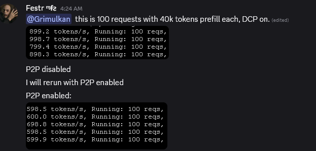

# Kimi K2.5 on RTX PRO 6000 Blackwell

## Table of Contents

- [Overview](#overview)
- [Available Checkpoints](#available-checkpoints)
- [Hardware Requirements](#hardware-requirements)
- [NCCL Environment Variables](#nccl-environment-variables)
- [Launch Commands -- vLLM](#launch-commands----vllm)
- [Launch Commands -- SGLang](#launch-commands----sglang)
- [Docker Images](#docker-images)
- [Decode Context Parallel (DCP)](#decode-context-parallel-dcp)
- [Reasoning Parser Configuration](#reasoning-parser-configuration)
- [Attention Backends Comparison](#attention-backends-comparison)
- [Speculative Decoding / EAGLE3](#speculative-decoding--eagle3)
- [Benchmark Results](#benchmark-results)
- [KV Cache Size and Memory](#kv-cache-size-and-memory)
- [BIOS and System Tuning](#bios-and-system-tuning)
- [Known Issues and Fixes](#known-issues-and-fixes)
- [Notable PR References](#notable-pr-references)

---

## Overview

| Parameter | Value |
|-----------|-------|
| Model | `moonshotai/Kimi-K2.5` |
| Total parameters | ~530B |
| Architecture | MoE with Multi-head Latent Attention (MLA) |
| Native quantization | INT4 (Marlin experts) |
| Minimum GPUs | **8x RTX PRO 6000** (96 GB each) |
| Vision capable | Yes |
| MTP support | **No** (no native Multi-Token Prediction heads) |
| Reasoning model | Yes -- uses `--reasoning-parser kimi_k2` |

Kimi K2.5 is a reasoning-capable MoE model with native INT4 quantization. It requires a minimum of 8x GPUs -- the model is already INT4 quantized and still does not fit on 4 cards. The only 4-GPU option is ktransformers with CPU offloading, or the REAP variant (`Ex0bit/Kimi-K2.5-PRISM-REAP-530B-A32B`) which fits on 4 cards but with "significantly worse" quality.

---

## Available Checkpoints

| Checkpoint | Quant Type | KV Cache | Best tok/s | KV Cache Capacity | Notes |
|---|---|---|---|---|---|
| `moonshotai/Kimi-K2.5` | INT4 Marlin (native) | BF16 | 90 (DCP=1) | ~190K tokens | Fastest single-batch decode |
| `moonshotai/Kimi-K2.5` | INT4 Marlin (native) | FP8 | 79 (DCP=1) | ~449K tokens | 2.4x more context than BF16 |
| `nvidia/Kimi-K2.5-NVFP4` | NVFP4 (ModelOpt) | FP8 | 53-55 | ~450K tokens | Slower than native INT4 |

**Key finding:** The NVFP4 variant is slower than native INT4 with Marlin kernels. As luke noted: "There's no point in doing nvfp4 kimi imo, the source weights were int4."

**FP8 KV cache warning:** Using `--kv-cache-dtype fp8` with the original Kimi checkpoint in SGLang drops speed to **16 tok/s** (unusable). The NVFP4 checkpoint allows FP8 KV at 55 tok/s. BF16 KV on original is fastest (90 tok/s) but with smallest context window.

---

## Hardware Requirements

Kimi K2.5 requires **8x RTX PRO 6000 Blackwell** (768 GB total VRAM) minimum. 4 GPUs will OOM.

### Tested systems

| System | CPU | Memory | xGMI | GPUs | Notes |
|---|---|---|---|---|---|
| Festr Turin | 2x EPYC 9575F 64-Core | DDR5-6400, 24x96 GB (2.2 TB) | 3x links | 8x RTX PRO 6000 SE | Primary reference system |
| Festr Genoa | 2x EPYC Genoa | DDR5-4800, 12 ch/CPU | 3x links | 8x RTX PRO 6000 SE | Budget system, slower |
| orangezed | 2x EPYC 9374F 32-Core | DDR5-4800, 10x48 GB | 2x links | 8x RTX PRO 6000 Max-Q WS | Memory bottleneck |
| luke | AMD TR Pro (single) | -- | N/A | 8x RTX 6000 Pro Max-Q | PCIe switches, overclocked GDDR7 |
| Grimulkan | AMD Turin (single) | -- | N/A | 8-16x RTX PRO 6000 | PCIe switches |

### Critical: DRAM configuration matters

orangezed's performance gap (9 tok/s vs Festr's 30 tok/s at 100K context) was partially attributed to:
- Only 5 DIMM channels per CPU (vs 12 for Festr)
- DDR5-4800 (vs DDR5-6400 on Turin)
- Only 2x xGMI links (vs 3x)

---

## NCCL Environment Variables

### For single-batch / low-latency (P2P enabled)

```bash
NCCL_P2P_LEVEL=SYS                    # Forces P2P via system path
NCCL_GRAPH_FILE=/mnt/nccl_graph_opt.xml  # Custom topology graph -- download below
NCCL_PROTO=LL                          # Force Low Latency protocol for all messages
```

**NCCL graph file download:**

```bash
wget https://www.voipmonitor.org/nccl_graph_opt.xml -O /mnt/nccl_graph_opt.xml
```

NCCL has a bug where it misdetects xGMI link speed as 16 GB/s instead of 48 GB/s, causing it to skip the low-latency protocol for smaller messages. The XML file or `NCCL_PROTO=LL` mitigates this.

### For high-concurrency / throughput (P2P disabled, DRAM routing)

```bash
NCCL_P2P_DISABLE=1
NCCL_MIN_NCHANNELS=32
NCCL_MAX_NCHANNELS=64
NCCL_BUFFSIZE=67108864
CUDA_DEVICE_MAX_CONNECTIONS=64
```

**Lighter alternative:**

```bash
NCCL_P2P_DISABLE=1
NCCL_MIN_NCHANNELS=16
NCCL_MAX_NCHANNELS=32
NCCL_BUFFSIZE=33554432
CUDA_DEVICE_MAX_CONNECTIONS=32
```

**Important:** `NCCL_P2P_DISABLE=1` alone is not enough; the channel/buffer settings are also required. Assumes full DRAM channels configured (12 channels per CPU for best results).

### vLLM-specific environment variables

```bash
VLLM_TEST_FORCE_FP8_MARLIN=1          # Force FP8 Marlin kernels
VLLM_MARLIN_USE_ATOMIC_ADD=1          # Required for Marlin MoE
VLLM_MARLIN_INPUT_DTYPE=fp8           # FP8 input to Marlin
VLLM_LOG_STATS_INTERVAL=1             # Log throughput stats every second
VLLM_VIDEO_LOADER_BACKEND=opencv_tempfile  # Video handling
VLLM_SLEEP_WHEN_IDLE=30               # Sleep consumer threads when idle
```

---

## Launch Commands -- vLLM

### Recommended: INT4 with FP8 KV Cache + DCP (Festr's production command)

```bash
VLLM_LOG_STATS_INTERVAL=1 \
NCCL_P2P_LEVEL=SYS \
NCCL_GRAPH_FILE=/mnt/nccl_graph_opt.xml \
VLLM_VIDEO_LOADER_BACKEND=opencv_tempfile \
VLLM_TEST_FORCE_FP8_MARLIN=1 \
VLLM_MARLIN_USE_ATOMIC_ADD=1 \
VLLM_MARLIN_INPUT_DTYPE=fp8 \
vllm serve moonshotai/Kimi-K2.5 \
  --served-model-name Kimi-K2.5 \
  --trust-remote-code \
  --host 0.0.0.0 --port 5000 \
  --tensor-parallel-size 8 \
  --pipeline-parallel-size 1 \
  --enable-chunked-prefill \
  --enable-prefix-caching \
  --load-format fastsafetensors \
  --tool-call-parser kimi_k2 \
  --enable-auto-tool-choice \
  --reasoning-parser kimi_k2 \
  --async-scheduling \
  --gpu-memory-utilization 0.95 \
  --max-num-batched-tokens 4096 \
  --attention-backend TRITON_MLA \
  --kv-cache-dtype fp8 \
  --mm-encoder-tp-mode data \
  --decode-context-parallel-size 8
```

**Required patches:** Cherry-pick PR #34597 (FP8 KV cache for Triton MLA decode) and PR #34795 (FP8 KV cache with DCP for MLA).

**Required installs:** `pip install fastsafetensors` (crashes without it if `--load-format fastsafetensors` is used).

### Without NCCL graph (orangezed's command)

```bash
VLLM_LOG_STATS_INTERVAL=1 \
NCCL_P2P_LEVEL=SYS \
NCCL_PROTO=LL \
VLLM_TEST_FORCE_FP8_MARLIN=1 \
VLLM_MARLIN_USE_ATOMIC_ADD=1 \
VLLM_MARLIN_INPUT_DTYPE=fp8 \
vllm serve moonshotai/Kimi-K2.5 \
  --served-model-name Kimi-K2.5 \
  --trust-remote-code \
  --host 0.0.0.0 --port 8003 \
  --tensor-parallel-size 8 \
  --pipeline-parallel-size 1 \
  --enable-chunked-prefill \
  --enable-prefix-caching \
  --load-format fastsafetensors \
  --tool-call-parser kimi_k2 \
  --enable-auto-tool-choice \
  --reasoning-parser kimi_k2 \
  --async-scheduling \
  --gpu-memory-utilization 0.93 \
  --max-num-batched-tokens 4096 \
  --attention-backend TRITON_MLA \
  --kv-cache-dtype fp8 \
  --mm-encoder-tp-mode data \
  --decode-context-parallel-size 8 \
  --language-model-only
```

---

## Launch Commands -- SGLang

### Original BF16 KV Cache (fastest single-batch, limited context)

```bash
NCCL_P2P_LEVEL=4 \
PYTORCH_CUDA_ALLOC_CONF=expandable_segments:True \
SGL_ENABLE_JIT_DEEPGEMM=0 \
python -m sglang.launch_server \
  --model moonshotai/Kimi-K2.5 \
  --tp 8 \
  --host 0.0.0.0 --port 5000 \
  --mem-fraction-static 0.94 \
  --enable-metrics \
  --attention-backend flashinfer \
  --tool-call-parser kimi_k2 \
  --reasoning-parser kimi_k2 \
  --served-model-name kimi-k2.5 \
  --chunked-prefill-size 8092 \
  --cuda-graph-max-bs 16 \
  --model-loader-extra-config '{"enable_multithread_load": true, "num_threads": 16}' \
  --trust-remote-code \
  --enable-mixed-chunk
```

Result: 73-90 tok/s decode, BF16 KV cache, ~170K-232K context tokens.

### NVFP4 Checkpoint

```bash
NCCL_P2P_LEVEL=4 python -m sglang.launch_server \
  --model-path nvidia/Kimi-K2.5-NVFP4 \
  --tensor-parallel-size 8 \
  --trust-remote-code \
  --reasoning-parser kimi_k2 \
  --tool-call-parser kimi_k2 \
  --moe-runner-backend triton \
  --quantization modelopt_fp4 \
  --model-loader-extra-config '{"enable_multithread_load": true,"num_threads": 119}' \
  --mem-fraction-static 0.93 \
  --cuda-graph-max-bs 8
```

Result: 53 tok/s, ~450K KV cache with FP8 cache.

### INT4 with EP and Custom Allreduce (luke's command, PCIe switches)

```bash
python3 -m sglang.launch_server \
  --model moonshotai/Kimi-K2.5 \
  --served-model-name Kimi-K2.5 \
  --tp 8 \
  --ep 8 \
  --enable-torch-compile \
  --trust-remote-code \
  --kv-cache-dtype fp8_e4m3 \
  --reasoning-parser kimi_k2 \
  --tool-call-parser kimi_k2 \
  --model-loader-extra-config='{"enable_multithread_load": "true","num_threads": 32}' \
  --chunked-prefill-size 32768 \
  --mem-fraction-static 0.9 \
  --host 0.0.0.0 \
  --port 8000 \
  --max-running-requests 8
```

**Requires:** luke's custom allreduce SGLang patch: https://github.com/lukealonso/sglang/commits/custom_ar/

Result: ~101 tok/s single batch (INT4, FP8 KV, small context). Overclocked GDDR7 memory helped get past 100.

---

## Docker Images

### Festr's patched vLLM Docker

```bash
docker run -it --rm \
  --entrypoint /bin/bash \
  -v /root/.cache/huggingface:/root/.cache/huggingface \
  -v /mnt:/mnt/ \
  --ipc=host --shm-size=8g \
  --ulimit memlock=-1 --ulimit stack=67108864 \
  --gpus all --network host \
  --mount type=tmpfs,destination=/usr/local/cuda-13.0/compat \
  voipmonitor/vllm-openai:cu130-nightly-patched
```

Then: `pip install fastsafetensors`

### SGLang official Docker

```bash
docker run -it --rm \
  -v /root/.cache/huggingface/:/root/.cache/huggingface/ \
  --ipc=host --shm-size=8g \
  --ulimit memlock=-1 --ulimit stack=67108864 \
  --gpus all --network host \
  lmsysorg/sglang:dev-cu13 bash
```

### SGLang Docker with custom allreduce

```bash
docker run -it --rm \
  --entrypoint /bin/bash \
  --gpus all \
  --ipc=host --shm-size=8g \
  --ulimit memlock=-1 --ulimit stack=67108864 \
  --network host \
  -v /root/.cache/huggingface:/root/.cache/huggingface \
  -v /mnt:/mnt \
  -v vllm-nightly-jit:/cache/jit \
  voipmonitor/llm-pytorch-blackwell:customallreduce
```

---

## Decode Context Parallel (DCP)

DCP (`--decode-context-parallel-size 8`) shares KV cache across all 8 cards. It is **critical for long context** with Kimi K2.5.

### How it works

- Increases total KV cache capacity by 8x (the KV cache is distributed)
- Slight speed reduction due to increased PCIe traffic for each decode step
- Without DCP, decode at 150K+ context drops to <10 tok/s
- With DCP=8, decode at 150K+ stays at 28-35 tok/s

### Impact on KV cache capacity

| Config | KV Cache Size (tokens) |
|---|---|
| FP8 KV, DCP=1, gpu-util=0.93 | ~449,600 |
| FP8 KV, DCP=8, gpu-util=0.93 | ~3,621,504 |
| BF16 KV, DCP=1 | ~190,000 |
| BF16 KV, DCP=8 | ~1,500,000 |

### Required patches for DCP

- vLLM PR #34597: FP8 KV cache support for Triton MLA decode attention (SM120)
- vLLM PR #34795: FP8 KV cache with Decode Context Parallel for MLA

### Without DCP, long context is unusable

| Context | Without DCP | With DCP=8 |
|---|---|---|
| 150K | ~6-7 tok/s | 28-35 tok/s |
| 200K | Extremely slow | ~28-35 tok/s |

Festr's observation: "I'm getting almost same speed with DCP at 200K context as at 0 context" (on Turin with NCCL graph).

---

## Reasoning Parser Configuration

Kimi K2.5 is a reasoning model. Always include both flags:

```bash
--reasoning-parser kimi_k2
--tool-call-parser kimi_k2
```

These flags enable:
- Proper parsing of Kimi's chain-of-thought reasoning blocks
- Correct tool call extraction from reasoning output

---

## Attention Backends Comparison

Grimulkan's comprehensive comparison (vLLM, 8x RTX 6000 Pro):

| Attention Backend | bf16 DCP=1 | bf16 DCP>1 | fp8 DCP=1 | fp8 DCP>1 | MTP |
|---|---|---|---|---|---|
| Triton MLA | Yes | Yes | Yes | Yes | Yes |
| FlashInfer FA2 | Yes | Yes | No | No | Yes |
| XQA | No | No | Yes | No | No |

### Peak decode tok/s by backend (8x cards, SM120)

| TP | DCP | KV Cache | KV Cache Space | Triton MLA | FlashInfer FA2 | XQA |
|---|---|---|---|---|---|---|
| 8 | 8 | fp8 | 3M tok | 68 | N/A | N/A |
| 8 | 1 | fp8 | 380K tok | 79 | N/A | N/A |
| 8 | 8 | bf16 | 1.5M tok | 67 | 72 | N/A |
| 8 | 1 | bf16 | 190K tok | 78 | 90 | WIP |

**Conclusion:** FA2 is fastest (90 vs 78 tok/s in bf16) but does not work with FP8 KV. For max throughput with long context: FP8 + DCP + Triton MLA remains best. XQA is a dead end currently (no DCP, no MTP, lacks LSE return needed for DCP integration).

---

## Speculative Decoding / EAGLE3

Kimi K2.5 does **not** have native MTP. EAGLE3 support is in development:

- SGLang PR: https://github.com/sgl-project/sglang/pull/19689
- vLLM PR: https://github.com/vllm-project/vllm/pull/35966
- Draft model: `AQ-MedAI/Kimi-K2-Instruct-eagle3`

Grimulkan reported that speculative decoding in vLLM was "strictly worse than no speculation" for Kimi K2.5 in all configurations tried so far. Potential for 30% improvement once EAGLE3 + FA2 is working.

---

## Benchmark Results

### Single-batch decode speed (8x RTX 6000 Pro)

| System | Config | 0K Context | 100K Context | 200K Context | Notes |
|---|---|---|---|---|---|
| Festr Turin | vLLM, FP8 KV, DCP=8, P2P | 65 tok/s | 36 tok/s | 27 tok/s | With NCCL graph |
| Festr Turin | vLLM, FP8 KV, DCP=8, no P2P | 44 tok/s | 29 tok/s | 23 tok/s | P2P disabled + channels |
| Festr Genoa | vLLM, FP8 KV, DCP=8 | ~32 tok/s | ~32 tok/s | -- | Slower than Turin |
| Grimulkan (switches) | vLLM, FP8 KV, DCP=8 | 62 tok/s | 32 tok/s | 21 tok/s | Normal NCCL |
| orangezed | vLLM, FP8 KV, DCP=8 | 32-35 tok/s | 8.6-10.2 tok/s | 19-20 tok/s | 5-channel DIMM bottleneck |
| Festr Turin | vLLM, BF16 KV, FA2, DCP=1 | **90 tok/s** | -- | -- | Best single batch |
| luke (switches) | SGLang, INT4 EP=8, custom AR | **101 tok/s** | -- | -- | Overclocked GDDR7 |
| CyySky | SGLang, BF16 KV | 90 tok/s | -- | -- | At 2K context, 232K total ctx |

### High concurrency (100 concurrent requests, 40K context each)

Festr: **900 tok/s total** with vLLM, FP8 KV, DCP=8, TP=8



### P2P vs no-P2P throughput (dual-CPU systems)

- MiniMax M2.5 test: P2P = 5,000 tok/s, P2P disabled = 10,000 tok/s (high concurrency)
- For low concurrency, P2P generates faster tokens; for high concurrency, DRAM routing wins.

### Long context measurement note

When measuring long context, distinguish between:
- **Decode throughput**: Read from vLLM stats log (generation only)
- **Wall-clock tok/s**: Includes prefill time -- much slower for long context

orangezed initially reported ~9 tok/s at 100K but was measuring wall-clock including prefill. Actual decode throughput was 30-35 tok/s.

---

## KV Cache Size and Memory

| Config | KV Cache Size |
|---|---|
| FP8 KV, DCP=1, gpu-util=0.93 | ~449,600 tokens |
| FP8 KV, DCP=8, gpu-util=0.93 | ~3,621,504 tokens |
| BF16 KV, DCP=1 | ~190,000 tokens |
| BF16 KV, DCP=8 | ~1,500,000 tokens |

**Note on fastsafetensors:** `--load-format fastsafetensors` allocates excess VRAM on GPU 0, reducing max context. With normal safetensors, `--gpu-memory-utilization 0.96` fits more context.

---

## BIOS and System Tuning

### Kernel boot parameters (Festr)

```
GRUB_CMDLINE_LINUX="rd.auto=1 rd.md=1 rd.md.conf=1 mitigations=off spectre_v2=off spec_store_bypass_disable=off l1tf=off mds=off tsx_async_abort=off srbds=off mmio_stale_data=off retbleed=off amd_iommu=off iommu=off"
```

After editing `/etc/default/grub`, run `update-grub` and verify with `cat /proc/cmdline`.

### BIOS settings (AMD EPYC)

- **AMD CBS -> DF Common Options**: Disable fabric P2P reordering
- **AMD CBS -> NBIO**: Enable Above 4G Decoding, enable SR-IOV
- **Resizable BAR**: Enable in BIOS (should be 96 GB per GPU, not 256 MB default)
- **GPU Display Mode**: Set to headless via https://developer.nvidia.com/displaymodeselector (gives largest BAR1)

### Modprobe config

```
# /etc/modprobe.d/uvm.conf
options nvidia_uvm uvm_disable_hmm=1
```

Without this, NCCL lockups occurred.

### Memory overclocking (Max-Q cards only)

```python
import pynvml
pynvml.nvmlInit()
count = pynvml.nvmlDeviceGetCount()
for i in range(count):
    h = pynvml.nvmlDeviceGetHandleByIndex(i)
    pynvml.nvmlDeviceSetMemClkVfOffset(h, 4000)
pynvml.nvmlShutdown()
```

Server Edition cards return `NVMLError_Unknown` for this call. Max-Q cards accept it. luke: "overclocking my GDDR7 got me a few percentage points, it's what got me over the hill to 101."

---

## Known Issues and Fixes

### 1. FP8 KV cache broken in SGLang (original checkpoint)

**Problem:** Using `--kv-cache-dtype fp8` with original `moonshotai/Kimi-K2.5` in SGLang drops to 16 tok/s.

**Workaround:** Use NVFP4 checkpoint (`nvidia/Kimi-K2.5-NVFP4`) which supports FP8 KV at 55 tok/s, or use BF16 KV cache at 90 tok/s (smaller context window).

### 2. 4 GPUs OOM

**Problem:** Model is already INT4 quantized and needs 8 cards minimum.

**Workaround:** Only option is ktransformers CPU offloading. The REAP variant fits on 4 cards but quality is "significantly worse, does not make any sense."

### 3. NCCL graph OOM

**Problem:** `NCCL error: Failed to CUDA calloc 10485760 bytes` when using NCCL graph XML with `--gpu-memory-utilization 0.95`.

**Fix:** Reduce to `--gpu-memory-utilization 0.93`.

### 4. fastsafetensors crash

**Problem:** vLLM crashes when `--load-format fastsafetensors` is used without the package.

**Fix:** `pip install fastsafetensors` or remove the flag.

### 5. Kimi reasoning + tool call bug

**Problem:** Kimi ends reasoning with a tool call, causing parsing issues.

**Fix:** https://github.com/vllm-project/vllm/pull/33646 (merged).

### 6. flashinfer_cutlass correctness bug

**Problem:** https://github.com/flashinfer-ai/flashinfer/issues/2708 -- causes silent correctness issues.

**Workaround:** Use `flashinfer_cudnn` instead (may be slightly faster too).

### 7. Malformed tool calls / garbage loops (SGLang)

Reported at context >150K tokens. No confirmed fix; potentially related to long-context degradation.

### 8. Custom allreduce breaks other models

Festr: "with enable your custom all reduce [on GLM5]: only first token is generated and the model produces nothing." Use `--disable-custom-all-reduce` for non-Kimi models.

---

## Notable PR References

| PR | Description | Status |
|---|---|---|
| vLLM #34597 | FP8 KV cache support for Triton MLA decode (SM120) | Key patch by Grimulkan |
| vLLM #34795 | FP8 KV cache with DCP for MLA | Key patch by Grimulkan |
| vLLM #33646 | Handle case when Kimi ends reasoning with tool call | Merged |
| vLLM #36322 | FlashInfer FA2 MLA attention backend for SM120 | By Grimulkan |
| vLLM #35966 | Kimi K2/DeepSeek EAGLE3 support | In progress |
| SGLang #19689 | Kimi K2.5 EAGLE3 support | In progress |
| SGLang #18434 | Pipeline parallel for Kimi | In progress |
| flashinfer #2708 | CUTLASS FP4 GEMM correctness bug | Needs patch |
| flashinfer #2689 | Fix 10 bugs in BF16 XQA MLA kernel for SM120 | Available |
| flashinfer #2675 | Support BF16 MLA on SM120 with shared-mem fallback | Available |

---

## PCIe Topology and Custom Allreduce

### Custom PCIe allreduce kernel (luke)

For systems with PCIe switches, luke developed a custom allreduce kernel:
- **Repo:** https://github.com/lukealonso/sglang/commits/custom_ar/
- Beats NCCL by 2-3x for small messages (<32 KB), NCCL wins at >64 KB
- **Only useful with PCIe switches**, slower on dual-CPU systems without switches

### PCIe benchmark tool

https://github.com/lukealonso/p2pmark
- `./p2pmark` -- bandwidth and topology
- `./p2pmark --latency` -- P2P latency
- `./p2pmark --allreduce` -- custom vs NCCL allreduce comparison

### Allreduce crossover (luke's switches, 8 GPUs)

| Size | Custom (us) | NCCL (us) | Winner |
|---|---|---|---|
| 256 B | 7.5 | 24.6 | custom 3.3x |
| 1 KB | 7.5 | 24.1 | custom 3.2x |
| 8 KB | 9.2 | 24.2 | custom 2.6x |
| 32 KB | 16.5 | 24.5 | custom 1.5x |
| 64 KB | 25.9 | 24.1 | NCCL 1.1x |
| 256 KB | 73.6 | 28.0 | NCCL 2.6x |

### Key insight

PCIe switches have ~100 ns cut-through latency vs CPU root port P2P at 1-2 us. A single-CPU system with PCIe switches outperforms dual-CPU EPYC systems for inference.
