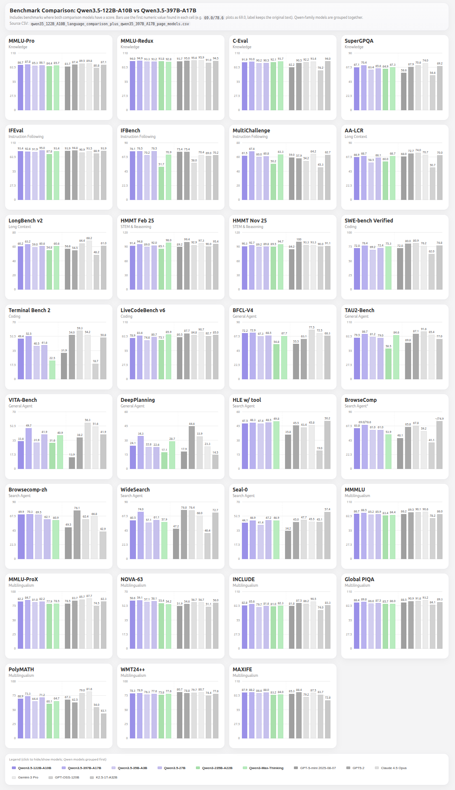

# Qwen3.5 Smaller Variants (27B, 35B, 122B) on RTX PRO 6000 Blackwell

## Table of Contents

- [Overview](#overview)
- [Available Checkpoints](#available-checkpoints)
- [Hardware Requirements](#hardware-requirements)
- [Launch Commands -- vLLM](#launch-commands----vllm)
- [Launch Commands -- SGLang](#launch-commands----sglang)
- [MTP / Speculative Decoding](#mtp--speculative-decoding)
- [Benchmark Results](#benchmark-results)
- [Quality Comparisons](#quality-comparisons)
- [Known Issues](#known-issues)

---

## Overview

The Qwen3.5 family includes several smaller models that share the same hybrid GDN/full attention architecture as the flagship 397B but at reduced parameter counts. These models are attractive for single-GPU or 2-GPU deployments.

| Model | Total Params | Active Params | Architecture |
|---|---|---|---|
| Qwen3.5-27B | 27B | 27B (dense) | Hybrid GDN/full attention |
| Qwen3.5-35B-A3B | 35B | 3B | MoE + hybrid GDN/full attention |
| Qwen3.5-122B-A10B | 122B | 10B | MoE + hybrid GDN/full attention |

Key finding from community testing: the 122B model shows "very little difference" from the 397B in benchmarks despite being >50% smaller.

---

## Available Checkpoints

### 27B (Dense)

| Checkpoint | Quantization | MTP | Multimodal | Notes |
|---|---|---|---|---|
| `Kbenkhaled/Qwen3.5-27B-NVFP4` | NVFP4 | No | No | Minimal quant, no extras |
| `osoleve/Qwen3.5-27B-NVFP4-MTP` | NVFP4 | Yes (bf16 weights) | No | MTP weights restored in bf16 |
| `Sehyo/Qwen3.5-27B-NVFP4` | NVFP4 | Yes | Yes | Full-featured: multimodal + MTP |

### 35B-A3B (MoE)

| Checkpoint | Quantization | MTP | Multimodal | Notes |
|---|---|---|---|---|
| `Sehyo/Qwen3.5-35B-A3B-NVFP4` | NVFP4 | Yes | Yes | Full-featured |

### 122B-A10B (MoE)

| Checkpoint | Quantization | MTP | Multimodal | Notes |
|---|---|---|---|---|
| `Qwen/Qwen3.5-122B-A10B` | Official FP8/BF16 | Yes | Yes | Official release |
| `Sehyo/Qwen3.5-122B-A10B-NVFP4` | NVFP4 | Yes | Yes | Full-featured |

### Sehyo NVFP4 Series (full family)

All Sehyo checkpoints include multimodal + MTP support:
- https://huggingface.co/Sehyo/Qwen3.5-27B-NVFP4
- https://huggingface.co/Sehyo/Qwen3.5-35B-A3B-NVFP4
- https://huggingface.co/Sehyo/Qwen3.5-122B-A10B-NVFP4

**Important:** Sehyo checkpoints (llm-compressor) have `kv_cache_scheme: null` -- no calibrated FP8 KV scales. They default to bf16 KV cache at runtime, using 2x more memory than calibrated FP8 KV cache.

---

## Hardware Requirements

| Model | NVFP4 | FP8 / BF16 |
|---|---|---|
| 27B | **1x RTX PRO 6000** (96 GB) | 1x RTX PRO 6000 |
| 35B-A3B | 1x RTX PRO 6000 | 1x RTX PRO 6000 |
| 122B-A10B | **2x RTX PRO 6000** | 2-4x RTX PRO 6000 |

---

## Launch Commands -- vLLM

### 27B NVFP4 with MTP (single GPU)

```bash
VLLM_SLEEP_WHEN_IDLE=1 VLLM_LOG_STATS_INTERVAL=1 \
vllm serve osoleve/Qwen3.5-27B-NVFP4-MTP \
  --served-model-name Qwen3.5-27B-NVFP4 \
  --trust-remote-code \
  --gpu-memory-utilization 0.85 \
  --max-model-len 128000 \
  --quantization modelopt \
  --tool-call-parser qwen3_coder \
  --enable-auto-tool-choice \
  --reasoning-parser qwen3 \
  --mm-encoder-tp-mode data \
  --mm-processor-cache-type shm \
  --speculative-config '{"method":"mtp","num_speculative_tokens":1}'
```

**Notes:**
- `VLLM_SLEEP_WHEN_IDLE=1` saves power when no requests are pending.
- `--quantization modelopt` is the vLLM flag for NVFP4 (vs `modelopt_fp4` in SGLang).
- MTP is set to 1 speculative token for stability on a single GPU.

### 27B with Sehyo checkpoint (multimodal + MTP)

```bash
VLLM_LOG_STATS_INTERVAL=1 \
vllm serve Sehyo/Qwen3.5-27B-NVFP4 \
  --served-model-name Qwen3.5-27B \
  --trust-remote-code \
  --gpu-memory-utilization 0.85 \
  --max-model-len 128000 \
  --quantization modelopt \
  --tool-call-parser qwen3_coder \
  --enable-auto-tool-choice \
  --reasoning-parser qwen3 \
  --mm-encoder-tp-mode data \
  --mm-processor-cache-type shm \
  --speculative-config '{"method":"mtp","num_speculative_tokens":1}'
```

---

## Launch Commands -- SGLang

The same SGLang flags from the 397B apply, adjusted for the smaller models:

### 27B NVFP4 (single GPU)

```bash
python -m sglang.launch_server \
  --model-path Sehyo/Qwen3.5-27B-NVFP4 \
  --tp-size 1 \
  --host 0.0.0.0 \
  --port 8000 \
  --trust-remote-code \
  --mem-fraction-static 0.85 \
  --quantization modelopt_fp4 \
  --attention-backend triton \
  --moe-runner-backend flashinfer_cutlass \
  --fp4-gemm-backend flashinfer_cudnn \
  --context-length 128000 \
  --reasoning-parser qwen3 \
  --tool-call-parser qwen3_coder \
  --sleep-on-idle
```

### 122B-A10B NVFP4 (2x GPUs)

```bash
python -m sglang.launch_server \
  --model-path Sehyo/Qwen3.5-122B-A10B-NVFP4 \
  --tp-size 2 \
  --host 0.0.0.0 \
  --port 8000 \
  --trust-remote-code \
  --mem-fraction-static 0.85 \
  --quantization modelopt_fp4 \
  --attention-backend triton \
  --moe-runner-backend flashinfer_cutlass \
  --fp4-gemm-backend flashinfer_cudnn \
  --context-length 262144 \
  --reasoning-parser qwen3 \
  --tool-call-parser qwen3_coder \
  --sleep-on-idle
```

---

## MTP / Speculative Decoding

MTP configuration is the same as the 397B model. For these smaller variants:

**vLLM:**
```bash
--speculative-config '{"method":"mtp","num_speculative_tokens":1}'
```

**SGLang:**
```bash
--speculative-algo NEXTN
--speculative-num-steps 3
--speculative-eagle-topk 1
--speculative-num-draft-tokens 4
```

**Checkpoint compatibility:**
- `osoleve/Qwen3.5-27B-NVFP4-MTP` -- MTP weights restored in bf16 (no multimodal)
- `Sehyo/Qwen3.5-27B-NVFP4` -- includes both MTP and multimodal
- `Kbenkhaled/Qwen3.5-27B-NVFP4` -- **no MTP, no multimodal**

---

## Benchmark Results

### 122B vs 397B comparison

Community assessment: "very little difference" in benchmark results despite the 122B being >50% smaller in total parameters.



### Heretic abliteration (Qwen3.5-35B)

| Benchmark | Heretic (abliterated) | Original | Delta |
|-----------|---------|----------|-------|
| MMLU Pro (100/cat) | 62.9% | 62.6% | +0.3 |
| IFEval Prompt Strict | 86.9% | 85.8% | +1.1 |
| IFEval Prompt Loose | 89.6% | 89.3% | +0.3 |
| IFEval Inst Strict | 90.9% | 90.3% | +0.6 |
| IFEval Inst Loose | 93.0% | 92.8% | +0.2 |

The Heretic abliterated model scores better than the original Qwen3.5-35B on both MMLU Pro and IFEval.

---

## Quality Comparisons

### Qwen3.5 vs competitors (community vibes-based assessment)

- **vs MiniMax M2.5**: M2.5 better for coding/agentic tasks. Qwen better for general reasoning, long context (2x better), instruction following, vision.
- **vs GLM-4.7**: Qwen on par overall. GLM slightly better for some coding tasks. Qwen "70% cases more detailed" in RAG pipelines.
- **vs Claude Opus 4.6 / Codex 5.3**: "Giant gap" -- Opus/Codex far superior for coding. Qwen good as "workhorse / code writer" with Opus as architect.
- **122B vs 397B**: "very little difference" in benchmarks.

---

## Known Issues

### Kbenkhaled checkpoint limitations

The `Kbenkhaled/Qwen3.5-27B-NVFP4` checkpoint has no multimodal support and no MTP weights. Use `osoleve` or `Sehyo` checkpoints if you need those features.

### Sehyo KV cache

Sehyo checkpoints default to bf16 KV cache (no calibrated FP8 scales). This uses 2x more VRAM for KV cache compared to checkpoints with calibrated FP8 scales. On a single GPU, this significantly reduces the maximum context length.

### Tool calling issues

The same tool calling issues from the 397B model apply to all Qwen3.5 variants. When MTP + thinking mode are both enabled, tool calls may output XML instead of JSON. See PR #35936 for the fix.
