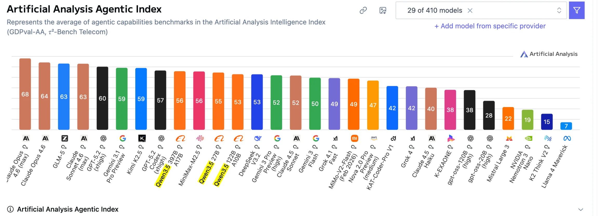

# Qwen3.5-397B-A17B on RTX PRO 6000 Blackwell

## Table of Contents

- [Overview](#overview)
- [Available Checkpoints](#available-checkpoints)
- [Hardware Requirements](#hardware-requirements)
- [NCCL Environment Variables](#nccl-environment-variables)
- [Launch Commands -- vLLM](#launch-commands----vllm)
- [Launch Commands -- SGLang](#launch-commands----sglang)
- [Docker Images](#docker-images)
- [MTP / Speculative Decoding](#mtp--speculative-decoding)
- [YaRN Extended Context (up to 900K)](#yarn-extended-context-up-to-900k)
- [Quantization Details](#quantization-details)
- [Thinking Mode Configuration](#thinking-mode-configuration)
- [Benchmark Results](#benchmark-results)
- [Memory Usage (VRAM)](#memory-usage-vram)
- [Known Issues and Fixes](#known-issues-and-fixes)

---

## Overview

Qwen3.5-397B-A17B is the flagship model of the Qwen3.5 family, using a **Hybrid Attention Architecture** combining Gated Delta Networks (GDN) with sparse Mixture-of-Experts (MoE).

| Parameter | Value |
|-----------|-------|
| Total parameters | 397B |
| Active parameters | 17B (very sparse MoE) |
| Attention layout | 3:1 hybrid -- three GDN (linear attention) blocks per one full attention block |
| Linear attention variant | Gated DeltaNet (combines Mamba2's gated decay with delta rule) |
| Multimodal | Natively multimodal via early fusion (no separate vision adapter) |
| Languages | 201 supported |

The Gated DeltaNet layers use a gated decay mechanism that eliminates attention sinks and massive activations, while every fourth block uses standard full attention for global context.



---

## Available Checkpoints

| Checkpoint | Quantization | KV Cache | Notes |
|---|---|---|---|
| `Qwen/Qwen3.5-397B-A17B-FP8` | FP8 | FP8 | Official. Requires **8x GPUs**. |
| **`QuantTrio/Qwen3.5-397B-A17B-AWQ`** | **AWQ INT4** | FP8 | **Recommended.** Best quality (KLD 0.024) AND best throughput (152 tok/s). Fits on **4x GPUs**. VLM format (vocab 248K). |
| `nvidia/Qwen3.5-397B-A17B-NVFP4` | NVFP4 (ModelOpt) | FP8 (calibrated scales) | Official NVIDIA. Fits on **4x GPUs**. Includes calibrated k_scale/v_scale tensors. |
| `lukealonso/Qwen3.5-397B-A17B-NVFP4` | NVFP4 (ModelOpt) | FP8 (calibrated scales) | Community re-quant. Better quality than nvidia (KLD 0.035 vs 0.109). Fits on **4x GPUs**. |
| `Sehyo/Qwen3.5-397B-A17B-NVFP4` | NVFP4 (llm-compressor) | BF16 (no FP8 scales) | Community. No calibrated FP8 KV cache scales -- defaults to bf16 KV cache (2x more memory). |
| `vincentzed-hf/Qwen3.5-397B-A17B-NVFP4` | NVFP4 | -- | Community, early quant. |
| `vpyn/Qwen3.5-397B-A17B-CARVE-v1-NVFP4` | NVFP4 | FP8 | Abliterated (uncensored). Better long-context performance than nvidia at >300K tokens. Do NOT use MTP (trained on censored content). |
| Hybrid NVFP4 (self-assembled) | NVFP4 + BF16 shared expert | FP8 | Shared expert in full BF16 for better quality. +1 GB. Requires SGLang patch. See [assembly guide](../optimization/hybrid-nvfp4-assembly.md). |

**Key difference -- NVIDIA vs Sehyo NVFP4:**

- **NVIDIA (ModelOpt):** `kv_cache_scheme: {num_bits: 8, type: float, dynamic: false}` -- calibrated FP8 KV cache scales present. Best accuracy.
- **Sehyo (llm-compressor):** `kv_cache_scheme: null` -- no calibrated FP8 KV scales. Defaults to bf16 KV cache at runtime (2x more VRAM for KV cache).

---

## Hardware Requirements

The primary tested hardware is **RTX PRO 6000 Blackwell** (96 GB VRAM each, PCIe Gen5 x16, no NVLink).

| Configuration | Model / Quant | Notes |
|---|---|---|
| **4x RTX PRO 6000** | NVFP4, TP=4 | Most common setup. ~82 GB per GPU at max context. |
| **8x RTX PRO 6000** | FP8, TP=8 | Or NVFP4 with TP=4 + DP=2. |
| **4x B200** | Various | Tested by James. |

### GPU Topology (typical 4x setup)

```
        GPU0    GPU1    GPU2    GPU3
GPU0     X      NODE    NODE    NODE
GPU1    NODE     X      NODE    NODE
GPU2    NODE    NODE     X      NODE
GPU3    NODE    NODE    NODE     X
```

All GPUs connected via PCIe through NUMA node (no NVLink). `NODE` = Connection traversing PCIe as well as the interconnect between PCIe Host Bridges within a NUMA node.

### Driver / CUDA Versions

- NVIDIA Driver: 580.126.09+
- CUDA Version: 13.0+
- VRAM per GPU: ~97,887 MiB
- Power limit: 280W per card

---

## NCCL Environment Variables

### Critical variables for 4x PCIe setup

```bash
# P2P level -- choose ONE:
NCCL_P2P_LEVEL=SYS         # Forces NVLink path. WARNING: If topology doesn't support NVLink, NCCL will deadlock/spin.
NCCL_P2P_LEVEL=PHB       # PCIe Host Bridge level (safer alternative)
NCCL_P2P_LEVEL=2         # Use if LEVEL=4 causes deadlock

NCCL_IB_DISABLE=1        # Disable InfiniBand (for consumer/workstation setups)

# If P2P levels cause issues, try auto-negotiation:
NCCL_P2P_DISABLE=0       # Let NCCL auto-negotiate P2P
```

### Performance tuning variables

```bash
SAFETENSORS_FAST_GPU=1            # Faster weight loading
OMP_NUM_THREADS=8                 # Limit OpenMP threads
VLLM_WORKER_MULTIPROC_METHOD=spawn  # Required for vLLM multi-GPU
VLLM_ALLOW_LONG_MAX_MODEL_LEN=1  # Allow >262K context
VLLM_SLEEP_WHEN_IDLE=1           # Save power when no requests
VLLM_LOG_STATS_INTERVAL=1        # Log stats every second
VLLM_NVFP4_GEMM_BACKEND=cutlass  # Control FP4 GEMM backend

SGLANG_ENABLE_SPEC_V2=true       # Enable spec decode v2
SGLANG_DISABLE_DEEP_GEMM=1       # Disable deep GEMM (stability)
SGLANG_SET_CPU_AFFINITY=1        # Bind to CPU cores
```

### Diagnosing NCCL deadlocks

If GPUs hit 100% utilization at ~140W with no VRAM growth, it is a classic NCCL deadlock:

1. Check topology: `nvidia-smi topo -m`
2. Try removing `NCCL_P2P_LEVEL=SYS` entirely, use `NCCL_P2P_DISABLE=0` instead
3. Enable debug: `NCCL_DEBUG=INFO NCCL_DEBUG_SUBSYS=ALL`
4. Fix was often: `NCCL_P2P_LEVEL=2` instead of 4

### CPU performance tuning

```bash
echo performance | tee /sys/devices/system/cpu/cpu*/cpufreq/scaling_governor
sysctl -w vm.swappiness=0
sysctl -w kernel.numa_balancing=0
sysctl -w kernel.sched_migration_cost_ns=50000
export SGLANG_SET_CPU_AFFINITY=1
```

---

## Launch Commands -- vLLM

### Recommended: nvidia NVFP4, 4x GPUs, with MTP=2

```bash
VLLM_LOG_STATS_INTERVAL=1 NCCL_P2P_LEVEL=SYS SAFETENSORS_FAST_GPU=1 \
python3 -m vllm.entrypoints.openai.api_server \
  --model nvidia/Qwen3.5-397B-A17B-NVFP4 \
  --host 0.0.0.0 --port 5000 \
  --served-model-name Qwen3.5-397B-A17B-NVFP4 \
  --trust-remote-code \
  --tensor-parallel-size 4 \
  --gpu-memory-utilization 0.8 \
  --max-num-batched-tokens 4096 \
  --max-num-seqs 128 \
  --enable-auto-tool-choice \
  --tool-call-parser qwen3_coder \
  --reasoning-parser qwen3 \
  --mm-encoder-tp-mode data \
  --mm-processor-cache-type shm \
  --speculative-config '{"method":"qwen3_next_mtp","num_speculative_tokens":5}'
```

> **Note:** `num_speculative_tokens:5` needs PR #35615 patch. Without the patch, set to `:1` max or tool errors occur. MTP>3 is unstable. **MTP=2 is the recommended sweet spot.**

### Quick-start Docker run (4x GPUs, MTP=2, production-ready)

```bash
docker run -d --gpus all --ipc=host --shm-size=16g \
  -p 5000:8000 \
  -e NCCL_P2P_LEVEL=SYS -e NCCL_IB_DISABLE=1 \
  -e SAFETENSORS_FAST_GPU=1 -e OMP_NUM_THREADS=8 \
  -e VLLM_WORKER_MULTIPROC_METHOD=spawn \
  -v ~/.cache/huggingface:/root/.cache/huggingface \
  orthozany/vllm-qwen35-mtp:latest \
  --model nvidia/Qwen3.5-397B-A17B-NVFP4 \
  --served-model-name qwen3.5 \
  --tensor-parallel-size 4 \
  --gpu-memory-utilization 0.80 \
  --max-num-batched-tokens 4096 \
  --max-num-seqs 128 \
  --trust-remote-code \
  --enable-prefix-caching \
  --enable-auto-tool-choice \
  --tool-call-parser qwen3_coder \
  --reasoning-parser qwen3 \
  --kv-cache-dtype fp8 \
  --speculative-config '{"method":"mtp","num_speculative_tokens":2}'
```

Expected: ~130 tok/s single stream, ~1100+ tok/s at 50 concurrent users.

### FP8 on 8x GPUs

```bash
vllm serve Qwen3.5-397B-A17B-FP8 \
  --port 9501 \
  --tensor-parallel-size 8 \
  --max-model-len -1 \
  --reasoning-parser qwen3 \
  --enable-auto-tool-choice \
  --tool-call-parser qwen3_coder \
  --gpu-memory-utilization 0.9 \
  --served-model-name llm_model \
  --speculative-config '{"method":"qwen3_next_mtp","num_speculative_tokens":2}'
```

### CARVE model + YaRN (up to 900K context)

```yaml
environment:
  - NCCL_P2P_LEVEL=SYS
  - NCCL_IB_DISABLE=1
  - VLLM_WORKER_MULTIPROC_METHOD=spawn
  - SAFETENSORS_FAST_GPU=1
  - OMP_NUM_THREADS=8
  - VLLM_ALLOW_LONG_MAX_MODEL_LEN=1

command: >
  --model vpyn/Qwen3.5-397B-A17B-CARVE-v1-NVFP4
  --served-model-name qwen3.5-carve
  --tensor-parallel-size 4
  --max-model-len 921600
  --max-num-seqs 16
  --gpu-memory-utilization 0.9
  --trust-remote-code
  --enable-prefix-caching
  --enable-auto-tool-choice
  --tool-call-parser qwen3_coder
  --reasoning-parser qwen3
  --kv-cache-dtype fp8
  --hf-overrides '{"text_config": {"rope_parameters": {"mrope_interleaved": true, "mrope_section": [11, 11, 10], "rope_type": "yarn", "rope_theta": 10000000, "partial_rotary_factor": 0.25, "factor": 4.0, "original_max_position_embeddings": 262144}}}'
```

### Important vLLM flags reference

| Flag | Notes |
|---|---|
| `--enable-expert-parallel` | **DO NOT USE** on PCIe setups. Kills batch throughput due to slow PCIe vs NVLink. |
| `--language-model-only` | Disables vision encoder. Reduces TTFT from 12s to <1s for first request. |
| `VLLM_NVFP4_GEMM_BACKEND=cutlass` | Env var to control FP4 GEMM backend. |
| `--mount type=tmpfs,destination=/usr/local/cuda-13.0/compat` | Fix CUDA compatibility between host 13.1 and container 13.0. |

---

## Launch Commands -- SGLang

### Recommended: 4x GPUs, stable baseline (no MTP, ~42-85 tok/s)

```bash
export SGLANG_DISABLE_DEEP_GEMM=1
export NCCL_IB_DISABLE=1
export NCCL_P2P_LEVEL=PHB
export OMP_NUM_THREADS=8
export SAFETENSORS_FAST_GPU=1

python -m sglang.launch_server \
  --model-path nvidia/Qwen3.5-397B-A17B-NVFP4 \
  --tp-size 4 \
  --host 0.0.0.0 \
  --port 8000 \
  --trust-remote-code \
  --mem-fraction-static 0.85 \
  --quantization modelopt_fp4 \
  --attention-backend triton \
  --moe-runner-backend flashinfer_cutlass \
  --fp4-gemm-backend flashinfer_cudnn \
  --context-length 262144 \
  --reasoning-parser qwen3 \
  --tool-call-parser qwen3_coder
```

### Recommended: AWQ-INT4, 4x GPUs, MTP=5 (152 tok/s)

```bash
NCCL_P2P_LEVEL=SYS SGLANG_ENABLE_SPEC_V2=True python3 -m sglang.launch_server \
  --model QuantTrio/Qwen3.5-397B-A17B-AWQ --served-model-name Qwen3.5 \
  --reasoning-parser qwen3 --tool-call-parser qwen3_coder \
  --tensor-parallel-size 4 --kv-cache-dtype fp8_e4m3 --trust-remote-code \
  --cuda-graph-max-bs 64 --max-running-requests 64 \
  --chunked-prefill-size 4096 \
  --speculative-algo NEXTN --speculative-num-steps 5 \
  --speculative-eagle-topk 1 --speculative-num-draft-tokens 6 \
  --mamba-scheduler-strategy extra_buffer \
  --mem-fraction-static 0.95 --host 0.0.0.0 --port 5000 \
  --disable-custom-all-reduce --attention-backend triton --enable-metrics
```

> **AWQ note:** SGLang auto-detects AWQ quantization from the config — do NOT add `--quantization`. The `--mamba-scheduler-strategy extra_buffer` flag is required because AWQ uses VLM format (`Qwen3_5MoeForConditionalGeneration`).

### With MTP / Speculative Decoding (8x GPUs, ~350 tok/s peak)

```bash
export SGLANG_ENABLE_SPEC_V2=True

python3 -m sglang.launch_server \
  --model nvidia/Qwen3.5-397B-A17B-NVFP4 \
  --served-model-name Qwen3.5 \
  --reasoning-parser qwen3 \
  --tool-call-parser qwen3_coder \
  --tensor-parallel-size 8 \
  --quantization modelopt_fp4 \
  --kv-cache-dtype fp8_e4m3 \
  --trust-remote-code \
  --attention-backend triton \
  --moe-runner-backend flashinfer_cutlass \
  --fp4-gemm-backend flashinfer_cudnn \
  --cuda-graph-max-bs 4 \
  --max-running-requests 4 \
  --context-length 262144 \
  --chunked-prefill-size 32768 \
  --speculative-algo NEXTN --speculative-num-steps 3 --speculative-eagle-topk 1 --speculative-num-draft-tokens 4 \
  --mamba-scheduler-strategy extra_buffer \
  --page-size 64 \
  --mem-fraction-static 0.85 \
  --host 0.0.0.0 --port 8000
```

> **Note:** The ~350 tok/s result (luke's 8x setup) uses `--expert-parallel-size 8` which requires custom patches and specific PCIe topology. Do NOT use on standard setups.

### FP8 on 8x GPUs (SGLang)

```bash
python -m sglang.launch_server \
  --model-path Qwen3.5-397B-A17B-FP8 \
  --host 0.0.0.0 --port 9501 \
  --tp-size 8 \
  --mem-fraction-static 0.8 \
  --context-length 262144 \
  --reasoning-parser qwen3 \
  --tool-call-parser qwen3_coder \
  --served-model-name llm_model \
  --speculative-algo NEXTN --speculative-num-steps 3 \
  --speculative-eagle-topk 1 --speculative-num-draft-tokens 4 \
  --attention-backend triton --fp8-gemm-backend triton \
  --moe-runner-backend triton
```

### SGLang Docker setup

```bash
sudo docker pull lmsysorg/sglang:dev-cu13
sudo docker run -it --rm \
  -v /home/gpusvr/:/home/gpusvr/ \
  --ipc=host --shm-size=8g \
  --ulimit memlock=-1 --ulimit stack=67108864 \
  --gpus all --network host \
  lmsysorg/sglang:dev-cu13 bash
```

---

## Docker Images

| Image | Purpose |
|---|---|
| `lmsysorg/sglang:dev-cu13` | SGLang nightly for Blackwell/CUDA 13 |
| `vllm/vllm-openai:cu130-nightly` | vLLM nightly for CUDA 13 |
| `orthozany/vllm-qwen35-mtp` | Custom vLLM image with cherry-picked Qwen3.5 MTP patches |
| vLLM v0.17.0 cu130 | Official release (2026-03-07), includes many Qwen3.5 fixes |

### orthozany/vllm-qwen35-mtp (recommended for vLLM)

This custom image cherry-picks critical PRs:
- PR #35219: FlashInfer Blackwell accuracy fix, zeros freed SSM cache blocks
- PR #35421: Tool call streaming fix for speculative decoding
- PR #35675: Fix Qwen3.5-nvfp4 MTP fc layer shape mismatch

**Dockerfile:**

```dockerfile
FROM vllm/vllm-openai:cu130-nightly@sha256:cd7d78a3db7251ef785485bfcec2a6375f8f798691fb59e71af877d5e72d51f

COPY patches/vllm/ /usr/local/lib/python3.12/dist-packages/vllm/
```

**docker-compose.yml (production):**

```yaml
services:
  vllm-qwen35-mtp:
    image: orthozany/vllm-qwen35-mtp:latest
    container_name: vllm-qwen35-mtp-test
    ipc: host
    shm_size: "16g"
    ports:
      - "5001:8000"
    environment:
      - NVIDIA_VISIBLE_DEVICES=4,5,6,7
      - NCCL_P2P_LEVEL=SYS
      - SAFETENSORS_FAST_GPU=1
      - VLLM_LOG_STATS_INTERVAL=1
    volumes:
      - /mnt/raid0/models/nvidia/Qwen3.5-397B-A17B-NVFP4:/model
    deploy:
      resources:
        reservations:
          devices:
            - driver: nvidia
              device_ids: ["4", "5", "6", "7"]
              capabilities: [gpu]
    entrypoint: >
      python3 -m vllm.entrypoints.openai.api_server
      --model /model
      --served-model-name Qwen3.5-397B-A17B-NVFP4
      --host 0.0.0.0 --port 8000
      --trust-remote-code
      --tensor-parallel-size 4
      --gpu-memory-utilization 0.80
      --max-num-batched-tokens 4096
      --max-num-seqs 128
      --enable-auto-tool-choice
      --tool-call-parser qwen3_coder
      --reasoning-parser qwen3
      --mm-encoder-tp-mode data
      --mm-processor-cache-type shm
      --speculative-config '{"method":"qwen3_next_mtp","num_speculative_tokens":5}'
    restart: unless-stopped
```

Result: ~150 tok/s decode at batch 1 on 4x Blackwell (vs ~75 tok/s without MTP).

### config.json patch (required for nvidia NVFP4 with MTP)

Add `"mtp.fc"` to the `quantization_config.ignore` list:

```json
"ignore": [
    "...existing entries...",
    "mtp.fc"
]
```

Also add `"model.language_model.layers..mlp.gate"` to both `config.json` AND `hf_quant_config.json`.

---

## MTP / Speculative Decoding

### MTP flags -- SGLang

```bash
--speculative-algo NEXTN
--speculative-num-steps 3
--speculative-eagle-topk 1
--speculative-num-draft-tokens 4
--speculative-draft-model-quantization unquant
```

### MTP flags -- vLLM

```bash
--speculative-config '{"method":"qwen3_next_mtp","num_speculative_tokens":2}'
```

Or for newer vLLM versions:

```bash
--speculative-config '{"method":"mtp","num_speculative_tokens":2}'
```

### Key findings

- **MTP=2 is the sweet spot** for nvidia NVFP4 on vLLM. Provides ~50-55% throughput improvement.
- **MTP=5** works for short context but is **unstable at long context**. Crashes with illegal memory access.
- **MTP>3** has a bug in vLLM causing crashes (PR #35615 partially fixes this).
- MTP was **slower** than no-MTP on SGLang in early testing.
- **CARVE model**: Do NOT use MTP since "MTP was trained on censored content" and the model is abliterated.
- MTP can cause **tool call format changes** (XML instead of JSON) when `tool_choice='required'`. Fix: PR #35936.
- `SGLANG_ENABLE_SPEC_V2=true` -- Required environment variable for SGLang spec decode v2.

### MTP acceptance rates (vLLM)

- Mean acceptance length: 2.73-3.69 tokens
- Per-position acceptance rates: ~0.85, 0.67, 0.51, 0.36, 0.31 (for 5 tokens)
- Average draft acceptance rate: 40-89%
- MTP=2 overall: 89.2% acceptance rate (165,550 drafted / 147,689 accepted)

### MTP throughput comparison (malaiwah, vLLM, nvidia NVFP4, 4x RTX PRO 6000)

| Workers | Baseline (no MTP) | MTP=2 | Improvement |
|---------|-------------------|-------|-------------|
| 1 | 85.8 tok/s | 130.0 tok/s | +51.5% |
| 2 | 137.1 tok/s | 212.7 tok/s | +55.1% |
| 5 | 234.2 tok/s | 358.6 tok/s | +53.1% |
| 10 | 334.3 tok/s | 573.5 tok/s | +71.6% |
| 20 | 491.5 tok/s | 744.1 tok/s | +51.4% |
| 32 | 605.9 tok/s | 922.6 tok/s | +52.3% |

---

## YaRN Extended Context (up to 900K)

To extend context beyond 262K (up to ~921K), use YaRN rope scaling with the CARVE model:

```bash
--hf-overrides '{"text_config": {"rope_parameters": {"mrope_interleaved": true, "mrope_section": [11, 11, 10], "rope_type": "yarn", "rope_theta": 10000000, "partial_rotary_factor": 0.25, "factor": 4.0, "original_max_position_embeddings": 262144}}}'
```

- **factor: 4.0** extends to ~921K max context (4x the original 262K)
- Requires `VLLM_ALLOW_LONG_MAX_MODEL_LEN=1` and `--max-model-len 921600`
- Works with FP8 KV cache (`--kv-cache-dtype fp8`)
- CARVE model performs **significantly better** at >300K with YaRN than the nvidia reference

---

## Quantization Details

### AWQ INT4 (recommended)

- Uses `QuantTrio/Qwen3.5-397B-A17B-AWQ` checkpoint
- SGLang auto-detects AWQ — no `--quantization` flag needed
- **Best quality** among all 4-GPU quantizations: KLD 0.024 (near-lossless)
- **Best throughput**: 152 tok/s single-stream, 1662 tok/s at C=64 (15-38% faster than NVFP4)
- VLM format with vocab_size=248320 — requires `--mamba-scheduler-strategy extra_buffer`
- See [KLD evaluation](../benchmarks/kld-evaluation.md) and [throughput benchmarks](../benchmarks/inference-throughput/)

### NVFP4 (4-bit floating point via NVIDIA ModelOpt)

- Uses `--quantization modelopt_fp4` (SGLang) or `--quantization modelopt` (vLLM)
- Fits 397B model on **4x RTX PRO 6000** (~96 GB each)
- Quality varies by checkpoint: lukealonso KLD 0.035 (good), nvidia KLD 0.109 (significant loss)
- 15-38% slower than AWQ at all concurrency levels

### FP8

- Requires **8x GPUs** for 397B model
- Uses `--kv-cache-dtype fp8_e4m3` or `--kv-cache-dtype fp8`
- Generally considered higher quality but 2x memory for KV cache

### KV Cache considerations

| Checkpoint | KV Cache | Notes |
|---|---|---|
| NVIDIA NVFP4 | FP8 with calibrated scales | Best -- proper calibrated k_scale/v_scale tensors |
| Sehyo NVFP4 | BF16 (default) | No FP8 scales. Can force `fp8_e4m3fn` but falls back to scale=1.0 (no calibration). |
| CARVE NVFP4 | FP8 | Works with YaRN for extended context. |

---

## Thinking Mode Configuration

### Disable thinking in vLLM

```bash
--default-chat-template-kwargs '{"enable_thinking": false}'
```

### System prompt to control thinking depth

```
[Thinking Mode: Active. Analyze the complexity of each request. For simple factual questions, keep reasoning brief. For complex analytical tasks, think carefully and analytically before responding.]
```

### Recommended sampling parameters

```json
{"temperature": 0.6, "top_p": 0.95, "top_k": 20, "min_p": 0.0}
```

Or:

```json
{"temperature": 1.0, "top_p": 0.95, "min_p": 0.01}
```

### Thinking mode performance impact

- Non-thinking: 98% accuracy, 191.3s runtime
- Thinking mode: 96% accuracy, 1623.5s runtime (8.5x slower)
- Recommendation: Use non-thinking mode by default on this hardware/checkpoint.

---

## Benchmark Results

### Decode throughput summary (single stream, 4x RTX PRO 6000 Blackwell)

| Config | Engine | MTP | tok/s | Notes |
|--------|--------|-----|-------|-------|
| **397B AWQ-INT4** | **SGLang** | **MTP=5** | **152** | **QuantTrio, best quality+speed** ([benchmarks](../benchmarks/inference-throughput/)) |
| 397B NVFP4 | SGLang | MTP=5 | 132 | lukealonso ([benchmarks](../benchmarks/inference-throughput/)) |
| 397B NVFP4 | SGLang | No | 42-51 | kcramp, Ixtrix |
| 397B NVFP4 | SGLang | Yes (3-step) | 85 | Festr (unstable) |
| 397B NVFP4 | SGLang | Yes | 350 | luke (8x, EP=8, heavily patched) |
| 397B NVFP4 | vLLM | No | 70-86 | Multiple users, stable |
| 397B NVFP4 | vLLM | MTP=2 | 130 | malaiwah |
| 397B NVFP4 | vLLM | MTP=5 | 150-250 | Festr, orangezed (code generation peaks) |
| 397B FP8 | SGLang | Yes | 75-125 | CyySky (8x GPUs) |

### Performance at various context lengths (CARVE model, no MTP, vLLM)

| Context | Decode tok/s |
|---------|-------------|
| 10K | 77 |
| 100K | 75 |
| 300K | 73 |
| 500K | 67 |
| 900K | 56 |

### CARVE vs NVIDIA reference comparison (no MTP, warm)

| Context | CARVE tok/s | nvidia REF tok/s | Winner |
|---------|------------|-----------|--------|
| 10K | 76.9 | 92.3 | REF +20% |
| 50K | 75.5 | 91.3 | REF +21% |
| 100K | 74.8 | 73.6 | ~tied |
| 200K | 74.3 | 95.5 | REF +29% |
| 300K | 73.3 | 43.8 | **CARVE +67%** |
| 400K | 67.9 | 42.3 | **CARVE +61%** |
| 500K | 67.0 | 42.2 | **CARVE +59%** |

Key finding: CARVE maintains much better performance at >300K context than the nvidia reference NVFP4.

### Comprehensive benchmark (malaiwah, vLLM, MTP=2, nvidia NVFP4, 4x RTX PRO 6000)

```
Peak Throughput:      1127.1 tok/s   50 users @ 1K
Best Efficiency:      120.0 tok/s/user   1 users @ 1K
Lowest Latency:       12.30s   1 users @ 1K
Total Benchmark Time: 50.8 minutes
```

67 tok/s single stream at 256K context.


### High-concurrency generation throughput (malaiwah, MTP=2)

```
Engine 000: Avg generation throughput: 1287.2 tokens/s, Running: 32 reqs
SpecDecoding metrics: Mean acceptance length: 2.82, Accepted throughput: 830.21 tokens/s
```

### MMLU-Pro results (vincentzed NVFP4 397B)

```
ALL CATEGORIES: 1206/12032 wrong (90.0% accuracy)

math:             96.3%    physics:     94.0%    biology:       95.0%
chemistry:        93.6%    business:    92.9%    comp. science: 92.0%
economics:        90.5%    engineering: 89.8%    psychology:    89.1%
philosophy:       87.6%    other:       85.9%    health:        85.1%
history:          81.6%    law:         79.0%
```

Comparison: Kimi-K2.5 89.8%, DeepSeek-V3.2-Speciale-AWQ 88.9%, GLM-4.7-FP8 88.3%.

---

## Memory Usage (VRAM)

- **397B NVFP4 on 4x GPUs**: ~82 GB per GPU at max context
- `gpu-memory-utilization 0.80-0.90` typical range
- Can reduce to 0.87 to fit a small embedding model alongside Qwen 397B
- Each RTX PRO 6000 Blackwell: 97,887 MiB total VRAM
- Loading with vision encoder adds TTFT overhead (~12s for first request); use `--language-model-only` if vision is not needed

### Expert parallel warning

`--enable-expert-parallel` causes significant inter-card PCIe traffic. "Killing batch throughput on pcie" -- only useful with NVLink.

---

## Known Issues and Fixes

### 1. CUDA Illegal Memory Access

**Error:** `torch.AcceleratorError: CUDA error: an illegal memory access was encountered`

Occurs in GDN attention backend during speculative decoding under load. Scheduler dump shows `all spec tokens rejected: [-1, -1, -1, -1, -1]`.

**Workarounds:**
- Reduce MTP tokens to 2 or 3 (MTP>3 unstable)
- Disable speculative decoding entirely
- Apply PR #35219 (zeros freed SSM cache blocks)
- Avoid high concurrent load with spec decode

**Open issue:** https://github.com/vllm-project/vllm/issues/34948

### 2. Weight size mismatch (nvidia NVFP4 on vLLM)

**Error:** `ValueError: Unsupported model when in features size is not multiple of 16`

**Fix:**
- Add `"mtp.fc"` and `"model.language_model.layers..mlp.gate"` to `quantization_config.ignore` list in config.json
- PR #35156: Hardcode mlp.gate as not quantizable
- PR #35675: Fix Qwen3.5-nvfp4 MTP fc layer shape mismatch

### 3. Tool call failures with MTP enabled

**Symptom:** Model outputs XML tool calls instead of JSON when `tool_choice='required'` and MTP is on. 50-70% of tool calls fail.

**Fix:** PR #35936. With `tool_choice='auto'`, it handles both XML and JSON. Thinking mode combined with MTP exacerbates the issue -- "if thinking is false, even with mtp there is no problem."

### 4. NCCL deadlock on startup

**Symptom:** GPUs at 100% utilization, ~140W power, no VRAM growth. Last log message: `vLLM is using nccl==2.28.9`.

**Fix:**
- Change `NCCL_P2P_LEVEL=2` instead of 4
- Or remove entirely and set `NCCL_P2P_DISABLE=0`
- Fix Docker mount order (file mount after directory mount)
- Test with `--tensor-parallel-size 1` first to isolate

### 5. CUDA compat library issue

**Symptom:** Docker crashes initializing CUDA when host has CUDA 13.1 and container has CUDA 13.0.

**Fix:**
```bash
--mount type=tmpfs,destination=/usr/local/cuda-13.0/compat
```

### 6. `<|endoftext|>` appearing in output

**Symptom:** Random `<|endoftext|>` tokens in output around 100K context. More stable with later patches.

### Key PRs for Qwen3.5 vLLM

| PR | Description |
|---|---|
| #35156 | Hardcode mlp.gate as not quantizable |
| #35219 | FlashInfer Blackwell accuracy fix, zero freed SSM cache blocks |
| #35421 | Tool call streaming fix for speculative decoding |
| #35581 | MTP fused kernel fix (~6% throughput boost) |
| #35615 | Fixes tool call streaming, allows MTP>1 |
| #35675 | Fix Qwen3.5-nvfp4 MTP fc layer shape mismatch |
| #35936 | Fix tool_choice='required' with MTP (XML->JSON parsing) |
| SGLang #18937 | NVFP4 support, merged into main |
