# PCIe Oneshot AllReduce for Inference

Custom PCIe allreduce kernel that replaces NCCL for small messages on PCIe topologies (without NVLink). Provides **~7% faster decode throughput on 4 GPU (same NUMA)** but **does not help on 8 GPU cross-socket** where Infinity Fabric latency makes the system-scope barrier too expensive.

> **Recommendation:** Use `--enable-pcie-oneshot-allreduce --enable-pcie-oneshot-allreduce-fusion` for **≤4 GPU** setups. For **8 GPU cross-socket**, stick with `--disable-custom-all-reduce` (NCCL is faster).

## Table of Contents

- [Overview](#overview)
- [How It Works](#how-it-works)
- [Benchmark Results](#benchmark-results)
- [Setup Guide](#setup-guide)
- [Server Launch Commands](#server-launch-commands)
- [Troubleshooting](#troubleshooting)

---

## Overview

During tensor-parallel decode, each layer performs AllReduce operations on small messages (typically 16–256 KB for attention/MoE layers). At these sizes, NCCL's ring protocol overhead dominates — the actual data transfer time is negligible compared to setup, synchronization, and protocol negotiation.

Luke's PCIe oneshot allreduce bypasses NCCL entirely for small messages using system-scope CUDA barriers and direct P2P writes, achieving **1.4–6× lower AllReduce latency** for messages up to 512 KB.

| Component | NCCL Ring | PCIe Oneshot |
|---|---|---|
| Protocol overhead | Ring setup, credit exchange | None (direct write) |
| Synchronization | Multi-stage ring | Single system-scope barrier |
| Data path | Ring: GPU→GPU→GPU→... | 1-stage: all GPUs write simultaneously |
| Fused RMSNorm | No | Yes (optional) |
| Best for | Large messages (>1 MB) | Small messages (<512 KB) |

**Source:** [github.com/lukealonso/sglang](https://github.com/lukealonso/sglang/commit/d39236aee635cca2725f94539358da0d1c85d8c2)

---

## How It Works

The kernel uses a one-shot approach: all GPUs write their data to all peers simultaneously via PCIe P2P, then a system-scope barrier ensures all writes are visible before each GPU reduces locally. Key features:

- **Double-buffered**: eliminates end-barrier overhead
- **Fused AllReduce + RMSNorm**: combines reduction with normalization in one kernel launch
- **Auto-crossover**: benchmarks at startup to find the optimal size threshold vs NCCL. Verified thresholds: **120 KB on 4 GPUs**, **48 KB on 8 GPUs**
- **Topology-aware**: auto-detects PCIe (non-NVLink) configurations

---

## Benchmark Results

All benchmarks on ASUS ESC8000A-E13P with 4× RTX PRO 6000 Blackwell (TP=4), Qwen3.5-397B-A17B-NVFP4, speculative decoding (MTP).

### Raw AllReduce Latency (PCIe oneshot vs NCCL)

Measured by the auto-crossover benchmark at server startup:

| Size | PCIe oneshot (µs) | NCCL (µs) | Winner |
|---|---|---|---|
| 1 KB | 6.1 | 13.5 | Custom 2.2× |
| 4 KB | 6.5 | 13.2 | Custom 2.0× |
| 8 KB | 6.4 | 13.9 | Custom 2.2× |
| 16 KB | 7.7 | 14.7 | Custom 1.9× |
| 32 KB | 9.2 | 15.6 | Custom 1.7× |
| 64 KB | 11.8 | 71.2 | Custom 6.0× |
| 128 KB | 17.6 | 24.7 | Custom 1.4× |
| 256 KB | 28.7 | 40.9 | Custom 1.4× |
| 512 KB | 51.0 | 71.7 | Custom 1.4× |
| 1 MB | 95.6 | 85.2 | **NCCL wins** |

Crossover at **512 KB**. For inference-relevant message sizes (16–256 KB), PCIe oneshot is **1.4–6× faster**.

### End-to-End Inference Throughput

Benchmark: [llm-inference-bench](https://github.com/voipmonitor/llm-inference-bench), context=0, duration=30s, max-tokens=2000.

```mermaid
xychart-beta
    title "Aggregate Throughput — Qwen3.5-397B NVFP4, TP=4, MTP"
    x-axis ["c=1", "c=2", "c=4", "c=8", "c=16", "c=32", "c=64"]
    y-axis "Tokens/sec" 0 --> 1400
    bar "PCIe oneshot" [74.9, 119.8, 217.5, 375.2, 608.1, 989.0, 1376.9]
    bar "NCCL only" [67.3, 110.8, 202.8, 356.1, 577.3, 940.2, 1283.1]
```



| Concurrency | PCIe oneshot (tok/s) | NCCL only (tok/s) | Improvement |
|---|---|---|---|
| 1 | 74.9 | 67.3 | **+11.3%** |
| 2 | 119.8 | 110.8 | +8.1% |
| 4 | 217.5 | 202.8 | +7.3% |
| 8 | 375.2 | 356.1 | +5.4% |
| 16 | 608.1 | 577.3 | +5.3% |
| 32 | 989.0 | 940.2 | +5.2% |
| 64 | 1376.9 | 1283.1 | +7.3% |

### Per-Request Latency

| Concurrency | PCIe oneshot (tok/s/req) | NCCL (tok/s/req) |
|---|---|---|
| 1 | 74.9 | 67.3 |
| 4 | 54.4 | 50.7 |
| 16 | 38.0 | 36.1 |
| 64 | 21.5 | 20.0 |

### Effect of NCCL_P2P_LEVEL=SYS

| Config | c=1 tok/s | c=64 tok/s | Notes |
|---|---|---|---|
| PCIe oneshot | 74.9 | 1376.9 | |
| PCIe oneshot + SYS | 74.6 | 1390.5 | ~0% effect |
| NCCL only | 67.3 | 1283.1 | |
| NCCL only + SYS | 69.7 | 1381.1 | +3.6% at c=1 |

`NCCL_P2P_LEVEL=SYS` has no effect on PCIe oneshot (it bypasses NCCL for small messages). For NCCL-only, SYS provides a small improvement.

### Cross-Model Verification (conc=1, context=0)

PCIe oneshot helps on **4 GPU (same NUMA)** but **hurts on 8 GPU cross-socket**:

#### 4 GPU (same NUMA) — recommended

| Model | MoE Backend | Without Oneshot | With Oneshot | Improvement |
|---|---|---|---|---|
| Qwen3.5-397B TP=4 | cutlass | 70.6 tok/s | 76.1 tok/s | **+7.8%** |
| Qwen3.5-397B TP=4 | b12x | — | 98.4 tok/s | — |
| Qwen3.5-397B TP=4 | b12x + MTP | — | 165.9 tok/s | — |

#### 8 GPU (cross-socket) — NOT recommended

| Model | Config | NCCL baseline | PCIe oneshot | Change |
|---|---|---|---|---|
| GLM-5 TP=8, b12x, no MTP | c=1 ctx=0 | 52.8 tok/s | 56.6 tok/s | +7.2% |
| GLM-5 TP=8, b12x, MTP | c=1 ctx=0 | 102.0 tok/s | 97.6 tok/s | **-4.3%** |
| GLM-5 TP=8, b12x, MTP | c=1 ctx=16k | 92.3 tok/s | 87.5 tok/s | **-5.2%** |
| GLM-5 TP=8, b12x, MTP | c=1 ctx=32k | 84.6 tok/s | 71.3 tok/s | **-15.7%** |

**Why 8 GPU is slower:** On dual-socket AMD EPYC, GPUs 0-3 and 4-7 are on separate NUMA nodes connected via Infinity Fabric. The PCIe oneshot kernel's system-scope barrier (`__threadfence_system`) must wait for visibility across the Infinity Fabric link, which adds significant latency. NCCL's ring/tree algorithms pipeline data and avoid global barriers, making them faster for cross-socket communication.

With MTP, the speculative tokens increase the effective batch size (and thus allreduce payload), pushing more messages above the 48KB crossover where NCCL wins — compounding the penalty.

### Auto Crossover Thresholds

The auto-crossover benchmark runs at server startup and determines the message size below which PCIe oneshot is used instead of NCCL:

| GPU Count | Crossover Threshold | Notes |
|---|---|---|
| 4 GPUs (same NUMA) | **120 KB** | Higher threshold — oneshot wins over a wider range |
| 8 GPUs (cross-NUMA) | **48 KB** | Much lower — Infinity Fabric latency penalizes system-scope barriers |

---

## Setup Guide

### Docker Image

```bash
docker run -it --rm --entrypoint /bin/bash \
  -v /root/.cache/huggingface:/root/.cache/huggingface \
  -v /mnt:/mnt/ \
  --ipc=host --shm-size=8g \
  --ulimit memlock=-1 --ulimit stack=67108864 \
  --gpus all --network host \
  voipmonitor/sglang:dev-cu130
```

### Applying the Patch

The base image `voipmonitor/sglang:dev-cu130` contains a partial version of the PCIe allreduce. To update to the latest version:

```bash
apt-get update -qq && apt-get install -y -qq patch curl
cd /opt/sglang
curl -sL https://github.com/lukealonso/sglang/commit/d39236aee635cca2725f94539358da0d1c85d8c2.patch \
  -o /tmp/pcie.patch
yes n | patch -p1 --force < /tmp/pcie.patch
```

The patch applies partially. Manual fixes required:

#### 1. Replace `pcie_allreduce.cu` entirely

The image has 477 lines, patch adds fused RMSNorm kernels (881 lines):

```bash
curl -sL "https://raw.githubusercontent.com/lukealonso/sglang/d39236aee635cca2725f94539358da0d1c85d8c2/python/sglang/srt/distributed/device_communicators/pcie_allreduce/pcie_allreduce.cu" \
  -o /opt/sglang/python/sglang/srt/distributed/device_communicators/pcie_allreduce/pcie_allreduce.cu
```

#### 2. Add exports to `pcie_allreduce/__init__.py`

Append to end of file:

```python
allreduce_rmsnorm = _ext.allreduce_rmsnorm
allreduce_gemma_rmsnorm = _ext.allreduce_gemma_rmsnorm
```

#### 3. Clear JIT cache

```bash
rm -rf /root/.cache/torch_extensions/
```

The CUDA extension recompiles automatically on next launch (~30 seconds).

#### 4. Add CLI flags to `server_args.py`

Add these dataclass fields after `disable_custom_all_reduce`:

```python
enable_pcie_oneshot_allreduce: bool = False
enable_pcie_oneshot_allreduce_fusion: bool = False
pcie_oneshot_allreduce_max_size: str = "auto"
```

And corresponding argparse entries in `add_cli_args()`.

See the [full commit](https://github.com/lukealonso/sglang/commit/d39236aee635cca2725f94539358da0d1c85d8c2) for complete changes to `custom_all_reduce.py`, `layernorm.py`, `communication_op.py`, and `server_args.py`.

---

## Server Launch Commands

### PCIe Oneshot AllReduce (Recommended)

```bash
SGLANG_ENABLE_SPEC_V2=True python3 -m sglang.launch_server \
  --model lukealonso/Qwen3.5-397B-A17B-NVFP4 \
  --served-model-name Qwen3.5 \
  --reasoning-parser qwen3 \
  --tool-call-parser qwen3_coder \
  --tensor-parallel-size 4 \
  --quantization modelopt_fp4 \
  --kv-cache-dtype fp8_e4m3 \
  --trust-remote-code \
  --attention-backend flashinfer \
  --moe-runner-backend flashinfer_cutlass \
  --fp4-gemm-backend flashinfer_cudnn \
  --cuda-graph-max-bs 64 \
  --max-running-requests 64 \
  --chunked-prefill-size 4096 \
  --mamba-scheduler-strategy extra_buffer \
  --mem-fraction-static 0.97 \
  --host 0.0.0.0 --port 5000 \
  --enable-metrics \
  --sleep-on-idle \
  --schedule-conservativeness 0.1 \
  --enable-pcie-oneshot-allreduce
```

### NCCL Only (Baseline Comparison)

```bash
SGLANG_ENABLE_SPEC_V2=True python3 -m sglang.launch_server \
  ... (same params as above, but replace last flag with:) \
  --disable-custom-all-reduce \
  --sleep-on-idle
```

### With NCCL_P2P_LEVEL=SYS

Add `NCCL_P2P_LEVEL=SYS` before the python command. Only improves NCCL baseline by ~3.6%.

---

## Troubleshooting

### `CUBLAS_STATUS_NOT_INITIALIZED`

Kill all python processes and wait before restarting:

```bash
pkill -9 -f python && sleep 5
```

### CUDA extension compilation fails

Clear cache and retry:

```bash
rm -rf /root/.cache/torch_extensions/
```

### `--enable-pcie-oneshot-allreduce` has no effect

- The flag was added by the patch. If missing, the old auto-enable behavior applies.
- `--disable-custom-all-reduce` overrides everything — do not combine with oneshot flag.
- Check logs for: `PCIe oneshot allreduce enabled (max_size=auto)`

### Performance is same as NCCL

- Verify patch applied correctly: check for `allreduce_rmsnorm` in `__init__.py`
- Look for crossover benchmark output in server startup logs
- Ensure `--enable-pcie-oneshot-allreduce` is in the command line
